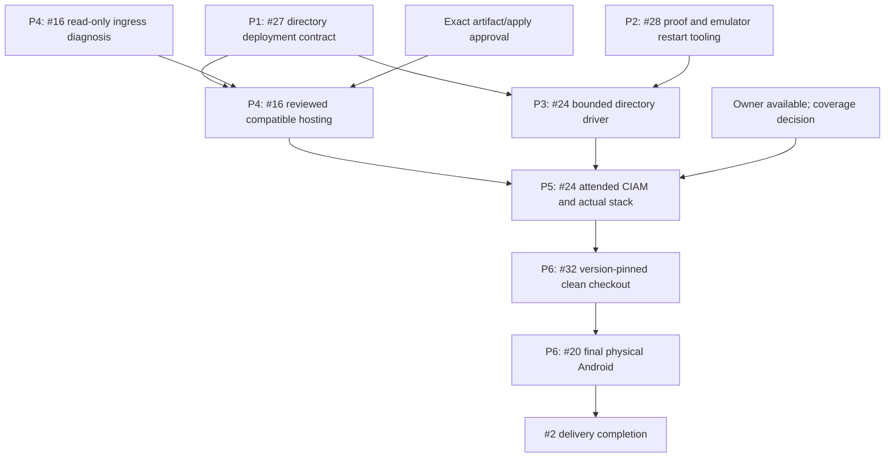

# Cosmos Sync delivery and deployment plan

Status: Approved
Date: 2026-10-06 JST
Mode: MODIFY
Runtime preparation candidate: `36f502fe5040f81164a9304992f6819b9d382c5a`

## 1. Goal and authorization

Finish the directory-enabled preview candidate and its selected real OIDC,
hosted Cosmos and final Android acceptance without rebuilding already completed
features. This document is the implementation plan, not implementation,
publication or deployment evidence. Local implementation is approved below;
publication and deployment require their own concrete review.

The owner approved execution of this plan on 2026-10-06. Local implementation,
nonpublishing validation and simulator work can proceed. Exact artifact,
deployment, additional identity and attended-operation gates below remain
separate; approval is not a waiver of actual acceptance evidence. Historical
owner pauses are lifted; simulator-first delivery and temporary unavailability
for attended login remain in effect until the owner changes them.

Keep Cosmos DB for NoSQL, validated API access JWTs, server-managed authorization
and server-selected partitions. ID tokens are limited to dedicated fresh-proof
routes. No email-based merging, client ownership claim, production test issuer,
authentication bypass or exposed Cosmos credentials. Atomic writes stop at one
logical partition; Graph, directory metadata and application data are separate.

Actual Google/Apple setup and connections are cancelled (#30, not planned).
Keep their navigation disabled and existing deterministic security coverage.
Physical iOS, Apple signing and new people are not prerequisites. Do not create
another customer or credential under the existing same-human exception.

## 2. Requirements and existing Azure context

| Attribute | Planning constraint |
| --- | --- |
| Classification | Experimental preview/development candidate, not a production SLA |
| Scale | Existing bounded reference directory and retained hosting limits; no automatic scale increase |
| Budget | Reuse approved retained resources; no new paid provisioning or cost increase approved here |
| Subscription | Previously approved selected subscription; exact identifiers remain in private context |
| Location | Previously approved West US 2 environment; no region change proposed |
| Identity | One original human and the specifically approved nonadministrative customer profile |
| Platforms | Native and Web development/fixtures first; final physical Android last |
| Distribution | Existing published artifacts unchanged; candidate publication requires explicit review |

Do not ask the owner to approve the same subscription/region again. Before an
actual resource operation, verify that the private target and live metadata
still match that approved context. Planning does not refresh Azure credentials
or establish current cloud health.

## 3. Verified baseline and implementation progress

[PR #39](https://github.com/anaregdesign/cosmos-sync/pull/39) is open and unmerged.
All nine candidate jobs passed at `36f502f` in
[CI 37428407923](https://github.com/anaregdesign/cosmos-sync/actions/runs/37428407923).
Exact clean-source Android process-death/replay and local nonpublishing
amd64/arm64 OCI checks also passed. Scoped preparation #27/#28 is completed;
actual hosted/customer/physical criteria remain open.

Historical baseline checks passed at `88be42e` in
[CI 37294322969](https://github.com/anaregdesign/cosmos-sync/actions/runs/37294322969).
Runtime `3214d0d` separately passed all nine checks in
[CI 37288105353](https://github.com/anaregdesign/cosmos-sync/actions/runs/37288105353).
Clean-source Android emulator SDK/app receipts belong to `3214d0d`, not this
later planning source. Local runtime, actual provider and hosted results must
remain distinguishable.

| Component | Reviewed source | Completed scope | Concrete remaining work |
| --- | --- | --- | --- |
| Go BFF | `bff/identity_runtime.go`, `identity_http.go`, `broker_proof.go`, `broker_directory.go` | Opt-in directory factory, exact API/ID correlation, uncached trusted profile, register/link/unlink, stable ownership, generation fences | Reviewed hosting artifact and actual hosted identity execution |
| Dart SDK | `packages/cosmos_sync/`, `tool/identity_probe.dart` | Typed lifecycle transport, identity-aware SQLite/IndexedDB fencing, shared recorded directory driver and signed local/emulator evidence | Actual approved hosted directory acceptance |
| Native/Web app | `examples/flutter_app/lib/auth/`, account lifecycle UI | Isolated fresh proofs, pending consent, cancellation/recovery, cache-open verification and clean emulator process-death/replay | Actual customer proof and final physical acceptance |
| ACA Terraform | `infra/terraform/azure-container-apps/` | Typed directory opt-in/image guard, assigned UAMI binding, 61 mock plans, strict generated-JSON/Go contract and clean nonpublishing image/CI; old modes preserved | Separate concrete artifact/activation review |
| Native live runner | `tools/native_entra_auth.py`, `entra_auth_live_test.dart` | API-only mode retained; transient directory-proof v2, provided/server nonce distinction, source-bound fresh failure receipts and foreground gate implemented | Actual attended customer evidence |
| Hosted SDK runner | `tools/directory_azure_live.py`, `test/directory_azure_live.dart` | Explicit recorded-directory preflight/data journey, immutable runtime/native-proof pinning, shared ledger, partial/unknown-outcome receipts and official Cosmos-emulator/candidate CI | Actual approved hosting/customer journey |
| Local cloud/UI runners | `tools/live_azure_contract.py`, `tools/flutter_azure_live.py`, `azure_live_ui_test.dart` | Separate legacy grants-file and recorded-token contracts | Cannot stand for directory authorization, hosted MI or actual fresh ordinary login |
| Retained Azure | Prior readback and Issues #16/#24 | Startup/configuration observed; minimum replicas returned to zero | Envoy 403, evaluated peer, log delivery and actual application data path remain unverified |

The reviewed IaC/proof/driver gaps are now implemented. The same recorded
preflight/data path measured 25/29 requests inside the signed TLS/Graph/Dart/SQLite
fixture; the full lifecycle uses its separate 54/80 fixture allowance. The actual
Android emulator exact-PID restart now passed from clean `36f502f`, with the same
installation, secure binding, exact pending operation/ACK and owned cleanup.
Native SDK/application, Chromium/Node, Python and BFF race/vet/build checks passed.
The pre-restart local Docker attempts failed before execution. After restart,
Docker is available and the complete official Cosmos-emulator suite passed with
the corrected private fixture namespace. All nine portable candidate jobs and
clean nonpublishing image checks passed; no image was published or activated.
Identity linking, Web support and core authorization must not be reimplemented
to work around the separate actual customer/artifact/hosting gates.

## 4. Recipe and architecture

Selected recipe: **existing Terraform and saved-plan workflow**.

Preserve the repository's locked providers, mock-plan tests, private state,
immutable saved-plan review and existing CLI runbooks. Do not introduce azd,
another framework or a new hosting service for this bounded modification.

Research sources: Azure Prepare's Container Apps, Cosmos DB, Key Vault and
Terraform references; the repository's pinned provider schemas and mock-plan
workflow. Retained GHCR/AzAPI hosting needs no new ACR, placeholder app, state
backend, log workspace or paid resource. Preserve managed-identity Cosmos/Graph
access, existing secret references and the existing topology instead of adopting
the references' unrelated new-resource examples. The mock-plan JSON contract
uses Terraform's versioned machine-readable test output.

The candidate keeps the existing topology:

- Ordinary native/Web app to HTTPS ACA BFF; API JWT on data routes.
- BFF to existing Cosmos NoSQL through the retained private endpoint and narrow
  managed-identity data role.
- BFF's explicit directory reader: retained UAMI assertion to the dedicated
  cross-tenant application, then target-only Graph `User.Read.All`.
- Existing Key Vault reference for the shared cursor key; no client credentials
  in Terraform runtime JSON, SDK configuration or public evidence.

API and ID proofs have distinct audiences and correlate exact signed `oid`/`tid`.
Do not require API/ID `sub` equality. The trusted upstream namespace/fingerprint,
not a mutable email or broker UID alone, selects immutable random account
ownership. Identity generation and numeric membership version remain separate.
Broker refresh/rotation is upstream; no new BFF token issuer is planned.

Keep the sole public-client namespace. Verify both native and SPA callbacks
against recorded registration before any login. Do not add another client or
silently widen `allowedClientIds` to make an unsupported callback work.

The serialized directory's existing capacity, retained proofs/audits/tombstones
and reserved unlink headroom stay unchanged. This plan adds neither garbage
collection nor account deletion/legacy migration endpoints.

## 5. Issue ownership and evidence transfers

| Issue | Revised responsibility | Required predecessors |
| --- | --- | --- |
| #27 | Complete directory-mode IaC/runtime/image compatibility and activation runbook; core identity implementation already complete | Completed #26/#29 evidence |
| #28 | Complete fresh-proof validation control, failure receipts and simulator restart tooling; auth adapters/UI already complete | Completed #18/#29 and existing lifecycle protocol |
| #16 | Resolve retained ingress/log diagnostics and verify compatible hosted identity readiness | #27 deployment contract; concrete artifact/apply review |
| #24 | Implement directory-aware bounded acceptance, then measure actual customer/API/ID/Flutter/BFF/Cosmos integration | #27/#28 contracts and #16 hosting checkpoint |
| #32 | Version-pin and reproduce the clean-checkout hosted onboarding journey | #24 integrated evidence and a reviewed candidate/artifact choice |
| #20 | Final selected Android actual login/cloud/OS/airplane/suspension evidence | #24/#32, completed simulator tooling and owner availability |
| #2 | Track candidate, evidence, decisions and final acceptance; publication already completed in its original scope | All applicable leaves |

The former cycles #16 -> #24 -> #16, #24 -> #20 -> #24 and
#32 -> #2 -> #32 are removed. Read-only ingress diagnosis can proceed alongside
#27/#28; a hosted rollout must wait for a reviewed compatible candidate.
Issue closure is not a prerequisite for reusing an already accepted milestone.

Transfer, do not delete, these original criteria:

- #27/#28 actual customer issuance and fresh authentication move to #24.
- Hosted UAMI/Graph readiness is owned by #16; its application-path correlation
  is verified in #24 and the exact receipt can be reused without another run.
- #16 document writes/two-client consistency and #28 actual ordinary UI flow
  move to #24, instead of repeating legacy and directory runs interchangeably.
- #28 simulator OS process death is tooling work; final physical OS behavior
  remains #20. Controller recreation is not either result.
- #32 consumes membership/identity coverage from #24. Actual separate-member
  and multi-credential coverage remains an unresolved scope gate, not a fixture
  pass or an authorization to create identities.

No Issue is closed by this review. #29 stays completed; #30 stays not planned.
Completed builtin Terraform #31 is not reopened or relabeled as directory work.

## 6. Implementation work packages

### P1: Directory deployment contract (#27)

Add typed, optional directory input to the existing workload module. Render the
exact `authorization.directory` schema only when directory mode is explicitly
selected. Match all production restrictions: CIAM issuer/tid, distinct API/client
GUIDs, one admitted client, exact callbacks, initial domain, reader and UAMI IDs,
approved source tenant namespace, no mixed legacy grants and production Cosmos.

Require an explicit compatible immutable image/source assertion. Treat that as
configuration review, not publication/apply permission. Preserve builtin/legacy
defaults, deny-all behavior, executable-only command, secret references,
prevent-destroy, narrow ingress/IAM and current replica bounds.

Add positive/negative mock plans and a JSON-to-Go configuration contract check:
directory opt-in, invalid/missing trust, wrong audience/client/callback, wrong
mode, unexpected fields, unsupported image and unchanged old modes. Test provider
or profile substitutes only inside test binaries; do not add production bypasses.
Document the activation/reuse/rollback sequence without adopting legacy data.

Output: selectable, offline-verified directory configuration and local image
build/smoke. No registry upload or Azure apply.

### P2: Proof and simulator validation tooling (#28)

Retain the current API-only workforce/customer runner as separately labeled
historical capability. Add a distinct directory-proof mode that obtains a real
BFF challenge and calls the existing isolated `freshIdentityProof` path.
Require exact selected customer, independently verified API/ID correlation,
server nonce, integer recent `auth_time`, expected callback and operation.
Neither `prompt=login`, `max_age=0`, API refresh nor `iat` is acceptance evidence.

Keep raw proof credentials transient, capability-bound and absent from logs,
arguments, assets and persistent evidence. Preserve primary credentials; discard
proof refresh credentials. Test cancellation, mismatches, duplicate/late
completion, interruption and missing/expired/noninteger proof data with signed
local fixtures. Expose no real-provider token issuer in production or CI.

Create redacted partial/failure receipts even when target/configuration preflight
fails before the control starts. Report fixed stage/reason codes, not raw provider
exceptions, accounts, identifiers or token claims. Do not reuse an old latest
pointer as proof of a new attempt. Keep the manual resumed owner gate and
manual-only physical pointer propagation.

Add a host-driven two-phase test on an exclusively owned emulator that actually
terminates/relaunches the selected app, preserving the same isolated credential
binding, SQLite cache and operation identity. Verify durable pending work and
exact replay after restart. Do not equate it to physical airplane/suspension or
reuse a connected physical device. Existing Chromium reload/IndexedDB tests are
already implemented and should be reused, not rebuilt.

Output: fixture-verified proof/failure protocol and real emulator process-restart
evidence. No attended customer login or physical operation during development.

### P3: Directory-aware acceptance driver (#24)

Do not switch a legacy runner's label to directory. Add an explicit versioned
manifest/control contract or separate mode with allowed directory routes,
capabilities/registration handling, exact approved native/SPA configuration,
identity-aware sessions and server-generated ownership.

Count health/data/proof requests, directory metadata commits/challenges/audits
and accepted document mutations separately. Registration consumes retained
directory capacity even if no document write is accepted. Keep an aggregate
budget, deadline, unknown-outcome stop, unique synthetic data, partial receipts
and owned-process/link cleanup. The existing "three mutations" hosted budget
cannot silently include new identity operations.

Exercise this same planned driver against signed local TLS/Graph fixtures and
the existing official-SDK Cosmos emulator before using cloud resources. Cover
explicit registration, verified session before cache open, offline reopen/exact
replay/ACK, two-client conflict and explicit resolution, tombstone, signout and
learned-generation invalidation. Preserve one-partition and no-rollback claims.

Support separate receipt labels for actual ordinary login and a recorded
signature-verified API-token adapter. Existing `flutter_azure_live.py` is
macOS/local-TLS/legacy and must not be presented as the hosted directory journey.

Output: offline-ready directory acceptance manifest and driver. Actual execution
waits for P4/P5 and the reviewed write/metadata budget.

### P4: Retained hosting diagnosis and activation readiness (#16)

Start with bounded read-only comparison of the existing app/environment/
revision, public/internal/subnet routing, exact ingress allow rule, diagnostic
destination and the correlated request peer. Use current private metadata only
when existing credentials work; do not open an unattended management login.
Do not infer Cosmos RBAC failure from Envoy 403, or log delivery from an empty
successful query. Repeat a probe only with a concrete diagnostic hypothesis and
the aggregate ledger, not as an unchanged loop.

Before an approved rollout, review the exact immutable candidate, generated
configuration, UAMI/FIC, target-only Graph grant, data-role/secret references and
saved plan. Preserve retained data/state, min0/max1 and policy; do not widen
Cosmos public access, add a role or repair the already-corrected callback.

Actual hosted readiness must distinguish routed HTTPS, configuration/startup,
UAMI assertion/exchange, exact uncached target Graph profile and Cosmos
metadata/credential checks. Operator-only read-only component probes must not
become production authentication bypass or credential-returning endpoints.
Actual API-authorized document operations are P5/#24, not startup proof.

Two independently constructed real-Cosmos BFFs need an approved reachable
execution location. The Mac cannot reach a private endpoint merely because its
IP is allowed at ACA. Keep the existing local two-BFF legacy harness separate.
One replica/two clients does not prove two hosted replicas; review an execution
path before claiming that original criterion, without new paid provisioning or
an implicit replica/network change.

Output: measured ingress/readiness result and a reviewed activation procedure.
Azure validation must precede deployment; no operation is executed by this plan.

### P5: Attended customer and integrated runtime acceptance (#24)

Only after the source/tooling and hosting checkpoint are ready, coordinate one
attended window. The owner alone handles browser/password/passkey/MFA prompts.
Verify the exact nonadministrative customer, not the workforce/admin profile.
Capture actual callback, initial/refreshed API verification and separate fresh
ID/server-nonce/authentication-time acceptance. Preserve missing-claim denial.
Correlate provider/run/configuration evidence; the earlier AADSTS50020 is not a
correlated Android result and the profile-reopening request was Mac.

Run the bounded ordinary app/SDK path through the compatible HTTPS BFF to the
existing Cosmos partition. Record actual hosted identity/profile checks,
accepted data operations, receipts/RU, same-account two-client conflict,
offline exact replay, watches/hint recovery, tombstone and purge.

Actual independent-member permission transitions and two-credential live
link/unlink cannot be supplied by one approved customer/credential. Keep their
scope decision unresolved until the owner explicitly selects either the exact
additional controlled-identity scope or a limited preview with deferred actual
coverage. No user is created and no criterion is silently marked passed.
Deterministic #29 coverage remains required in either case.

### P6: Onboarding then final Android (#32, #20)

Pin the candidate commit, package source/version, image digest, authorization
mode and existing target in the clean-checkout instructions. The published
`0.2.0-dev.1` package and existing images do not contain the directory extension.
A source-local candidate journey is not a published-consumer result; decide the
candidate/artifact path before execution. Do not silently republish or migrate
the original artifacts to finish #32.

Reproduce #24's ordinary app/SDK journey from that exact checkout without a
custom gateway or undocumented local file. Reuse an exact matching hosted
receipt only for identical source/configuration/target/scope. Record incomplete
membership/provider/replica coverage explicitly.

Finally run only the selected physical Android with the owner present. Actual
device login/cloud, OS death/relaunch, airplane mode and suspension are separate
observations. Retain current physical-input gating; connected alone is not
execution permission. Physical iOS and actual Google/Apple remain outside scope.

## 7. Dependencies and execution order

P1 and P2 are independent development work. P3 follows their tested contracts.
Read-only P4 diagnosis can be independent, but hosted activation is separately
gated. P5 needs actual owner/hosting readiness. P6 puts physical work last.
No calendar deadline is promised while those external gates remain unresolved.

## 8. Validation and Issue closure

| Change | Smallest relevant existing validation |
| --- | --- |
| Directory IaC/configuration | Locked offline Terraform format/init/validate/mock plans/TFLint, Go configuration/factory tests and builtin/legacy negative cases |
| Native/Web proof control | Native-control Python tests, native/Web auth unit/widget tests, Node/MSAL tests and actual Chromium proof/cancellation paths |
| Simulator restart | Selected disposable Android runtime, zero exit plus exact stage/runtime assertions, unchanged operation/cache binding and owned cleanup |
| Directory driver/protocol | Python bounds/partial-receipt tests, BFF and Dart tests, signed TLS/Dart/SQLite cross-stack and all official-SDK emulator cases |
| Candidate | Local nonpublishing container check, package mirrors/dry run where relevant, all nine portable CI jobs at the exact candidate head |
| Actual acceptance | Matching source/image/configuration/target, real customer/proof, actual host/Graph/Cosmos, bounded result/RU and honest incomplete fields |

Use CI's portable commands and expand only tests needed by a change. Protocol
changes must run both BFF and Dart tests and update `docs/protocol.md`, its package
mirror, adapters and examples together. Documentation-only planning needs no
new runtime execution.

Do not close an Issue because another issue or the container is green. Close
each leaf only when its revised scoped criteria and evidence pass; moved live
criteria remain mandatory in their named owner Issue. PR merge is separate from
source/CI completion and no merge is authorized here.

## 9. Provisioning inventory and decision gates

This preparation deploys **zero** resources and executes **zero** Azure plans/
applies. No subscription quota or replica allocation is changed or claimed
validated. Live quota/capacity checks are not applicable to this zero-operation
review; they must be completed for an explicitly approved execution plan if its
inventory changes. The retained environment continues to have costs.

| Gate | Required decision/evidence |
| --- | --- |
| Implementation | Approved by the owner on 2026-10-06; execute and verify P1/P2/P3, then persist measured evidence |
| Candidate distribution/hosting | Exact compatible immutable artifact and reviewed saved plan; no development publication or retained-image overwrite |
| Namespace/data | Explicit new directory provenance; no automatic builtin/legacy ownership migration |
| Real credential/member coverage | Owner decision on incompatible one-customer versus independent-credential/member criteria; no silent waiver or extra identity |
| Attended authentication | Owner availability and coordinated current selected-customer session after readiness |
| Federation expiry | Recorded seven-day source-secret expiry is `2026-10-11T22:17:06Z`; inspect metadata before a run and obtain scoped rotation review if expired |
| Real two-BFF reachability | Approved execution path inside the existing private topology; no public-Cosmos or unreviewed network/replica shortcut |
| Final device | Owner-operated selected Android only, after source/cloud/onboarding; no iOS blocker |

The source secret value never belongs in the plan, chat, Issues or Terraform.
Do not rotate it automatically or repeat the completed callback-only repair.
Existing reader permissions and same-human setup are recorded configuration,
not proof of current customer issuance or hosted execution.

## 10. Planning checklist and execution stop

- [x] Review current open Issues, completed/cancelled scopes and exact-head PR evidence.
- [x] Trace configuration, adapters, native/hosted/local cloud tools and their actual limits.
- [x] Select existing recipe and retained architecture; propose no new resources.
- [x] Assign nonduplicated source/tooling/live/device criteria and acyclic dependencies.
- [x] Record validation targets, version boundaries and unresolved decisions.
- [x] Owner approves implementation plan (2026-10-06).
- [x] Implement and locally verify source/proof/recorded-driver work and initial emulator OS restart.
- [x] Persist runtime candidate `36f502f`, repeat restart cleanly and complete nonpublishing container/Cosmos-emulator checks and all nine exact-candidate CI jobs.
- [ ] Review a concrete activation artifact/plan and complete Azure validation.
- [ ] Execute separately authorized deployment and attended acceptance.
- [ ] Reproduce onboarding, final Android and close scoped leaves with evidence.

Execute approved local work first. Do not mark this document Ready for
Validation, Validated or Deployed without the corresponding real work/evidence.

## 11. Owner-requested restart pause, 2026-10-06

Pause execution at the owner's request for a machine/device restart. This is a
temporary handoff, not cancellation of the approved implementation plan or
authorization of its separately gated live operations.

P1/P2/P3 source, tests, examples and related documentation are being preserved on
the existing PR branch. Local BFF vet/race/build, 186 native SDK/164 Chromium
cases, 108 native app/24 Chromium/19 Node cases and 196 portable tool tests passed.
The signed directory lifecycle passed at 54/80 fixture requests; its shared
recorded preflight/data path measured 25/29 with all 16 stages. Actual Android
emulator exact-PID SIGKILL/relaunch preserved secure binding, pending operation
and matching ACK/deduplication, but that receipt still identifies dirty source
based on `c9f3402`. It is not clean-candidate acceptance.

The owned emulator is stopped, its exact disposable AVD/registration and private
target file are removed, and its ports are released. Owned fixture processes and
individual reverse mappings were already cleaned. No session automation is
attached. Shared Docker/ADB services and physical devices were not terminated or
modified for the pause.

Resume in this order:

1. Read the current #2 handoff and exact candidate CI, including nonpublishing
   container and official Cosmos-emulator jobs. Local Docker engine sockets were
   unavailable; failed local attempts must not be relabeled passed.
2. Repeat the restart fixture from the exact clean candidate using a newly owned
   supported emulator, fresh private target/evidence and explicit installation
   authorization. No physical fallback or shared package/data clearing.
3. Finish #27/#28 source/tooling acceptance and #24's offline checklist only when
   the revised criteria actually pass; keep actual integration criteria open.
4. Continue bounded read-only #16 diagnosis with existing credentials, then
   separately review immutable artifact/saved plan, live coverage/reachability
   and attended customer/onboarding/final Android gates.

Do not start unattended customer/management login, rotate the source secret,
publish, apply, widen a policy, create an identity or operate the connected
physical phone on resumption without its applicable authorization. The real
ledger remains seven attempts and zero accepted document mutations.

## 12. Restart resumption and approved CI repair, 2026-10-06

The owner reported restart completion and explicitly approved the concrete
fixture repair, candidate CI recheck and clean-source emulator restart. This
supersedes section 11's temporary execution pause for the existing approved
local/simulator work; all separate live-operation gates remain unchanged.

Exact `f300273` CI completed with eight successful jobs and one failed
Cosmos-emulator job. Its directory capability check correctly rejected a private
Dart manifest that used the broker's default namespace while the BFF fixture
configured `dart-http-emulator-v1`. Use the actual configured namespace in that
manifest; do not relax the capability or production authorization checks.

A new nondefault-namespace memory fixture reproduced the identical failure
before the repair. Both default/nondefault signed lifecycle paths and all eleven
official Cosmos-emulator subtests passed after it, as did the three recorded
directory preflight cases, including wrong-namespace/account denial. The
emulator's isolated database and newly created container were cleaned. This is
signed local issuer/Graph fixture evidence, not actual customer, hosted Graph or
Azure consistency evidence.

The repair is committed/pushed at `36f502f`. All nine exact-candidate jobs passed;
clean local multiarch OCI and newly owned Android exact-PID restart checks passed,
with owned builder/app/reverse/emulator/AVD cleanup. Preparation #27/#28 is
completed and #24's offline checklist is complete. Their exact hashes/results
are in the existing English Issues; failed `f300273` remains a historical failure.

## 13. Retained hosting read-only checkpoint, 2026-10-06

Existing credentials still permit the specifically approved metadata reads; no
new management login was opened. App/environment/workspace read back Succeeded.
The sole ingress allow rule, assigned UAMI, executable-only command, original
builtin image/configuration and min0/max1 are unchanged. The active revision is
Healthy/Provisioned/ScaledToZero with zero replicas. ResourceHealth still reports
UnsupportedResourceType, not an application failure.

The environment remains external/noninternal with its approved subnet and Azure
Monitor destination. HTTP diagnostics point to the approved workspace, support
the ContainerAppHTTPLogs category and read back a null destination type. A bounded
query of existing target HTTP records since October 4 returned zero rows, including
zero correlated health/403/peer records. Existing request/replica metrics supplied
52 hourly values, with request total zero and maximum replica count zero. This
does not identify the evaluated peer or prove log delivery or routed BFF health.

No new BFF probe, document write, policy/identity/secret change, scale action or
deployment was made; the aggregate ledger remains seven requests. Do not infer a
Cosmos authorization error from historical Envoy 403, or fix nullable logging
metadata speculatively. #16 remains open for measured routing/log delivery and
actual hosted identity readiness.

The normal publication workflow admits only an explicitly approved main SHA
with completed main CI. PR merge, a new source-addressed container publication
and a concrete saved activation plan are separate decisions; do not publish a
development package, weaken this release gate or overwrite retained artifacts
to sidestep them. The SDK can remain pinned source until separately reviewed
distribution. Attended customer, controlled identity/member coverage, private
two-BFF reachability, onboarding and final Android retain their existing gates.
