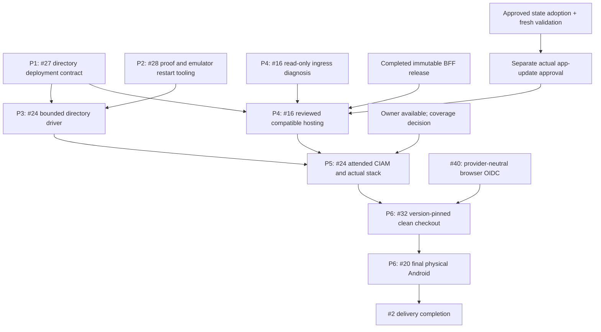

# Cosmos Sync delivery and deployment plan

Status: Validated
Current scope: Generic browser source and distinct private six-binding management preparation completed; actual Azure activation and attended acceptance remain separately unauthorized.
Previous validation: Read-only mirror/saved directory plan passed at `adbf0da`; retained as reference evidence.
Date: 2026-10-06 JST
Mode: MODIFY
Runtime preparation candidate: `36f502fe5040f81164a9304992f6819b9d382c5a`
Published runtime source: `36d2680e5f88d31acfafa4473d0d4996f1de0ff7`

## 1. Goal and authorization

Finish the directory-enabled preview candidate and its selected real OIDC,
hosted Cosmos and final Android acceptance without rebuilding already completed
features. This document is the implementation plan, not implementation,
publication or deployment evidence. Local implementation is approved below;
publication and deployment require their own concrete review.

The owner approved execution of this plan on 2026-10-06. Local implementation,
nonpublishing validation and simulator work can proceed. Exact artifact,
deployment, additional identity and attended-operation gates below remain
separate; approval is not a waiver of actual acceptance evidence. Historical
owner pauses are lifted; simulator-first delivery and temporary unavailability
for attended login remain in effect until the owner changes them.

Keep Cosmos DB for NoSQL, validated API access JWTs, server-managed authorization
and server-selected partitions. ID tokens are limited to dedicated fresh-proof
routes. No email-based merging, client ownership claim, production test issuer,
authentication bypass or exposed Cosmos credentials. Atomic writes stop at one
logical partition; Graph, directory metadata and application data are separate.

Actual Google/Apple setup and connections are cancelled (#30, not planned).
This excludes live provider operations, not providers from the OIDC contract.
Keep authentication provider-neutral and preserve deterministic security coverage.
The current unconfigured reference environment does not advertise social
navigation; that is not a global Apple/Google denylist.
Physical iOS, Apple signing and new people are not prerequisites. Do not create
another customer or credential under the existing same-human exception.

## 2. Requirements and existing Azure context

| Attribute | Planning constraint |
| --- | --- |
| Classification | Experimental preview/development candidate, not a production SLA |
| Scale | Existing bounded reference directory and retained hosting limits; no automatic scale increase |
| Budget | Reuse approved retained resources; no new paid provisioning or cost increase approved here |
| Subscription | Previously approved selected subscription; exact identifiers remain in private context |
| Location | Previously approved West US 2 environment; no region change proposed |
| Identity | One original human and the specifically approved nonadministrative customer profile |
| Platforms | Native and Web development/fixtures first; final physical Android last |
| Distribution | Owner-approved directory BFF published; SDK archive unchanged; actual activation remains separately gated |

Do not ask the owner to approve the same subscription/region again. Before an
actual resource operation, verify that the private target and live metadata
still match that approved context. Planning does not refresh Azure credentials
or establish current cloud health.

## 3. Verified baseline and implementation progress

[PR #39](https://github.com/anaregdesign/cosmos-sync/pull/39) was separately
owner-approved and merged as `36d2680e5f88d31acfafa4473d0d4996f1de0ff7`.
All nine exact main-push jobs passed in
[CI 37433122046](https://github.com/anaregdesign/cosmos-sync/actions/runs/37433122046).
The original source/tooling evidence below remains attributed to its candidate.
All nine candidate jobs passed at `36f502f` in
[CI 37428407923](https://github.com/anaregdesign/cosmos-sync/actions/runs/37428407923).
Exact clean-source Android process-death/replay and local nonpublishing
amd64/arm64 OCI checks also passed. Scoped preparation #27/#28 is completed;
actual hosted/customer/physical criteria remain open.

Historical baseline checks passed at `88be42e` in
[CI 37294322969](https://github.com/anaregdesign/cosmos-sync/actions/runs/37294322969).
Runtime `3214d0d` separately passed all nine checks in
[CI 37288105353](https://github.com/anaregdesign/cosmos-sync/actions/runs/37288105353).
Clean-source Android emulator SDK/app receipts belong to `3214d0d`, not this
later planning source. Local runtime, actual provider and hosted results must
remain distinguishable.

| Component | Reviewed source | Completed scope | Concrete remaining work |
| --- | --- | --- | --- |
| Go BFF | `bff/identity_runtime.go`, `identity_http.go`, `broker_proof.go`, `broker_directory.go` | Opt-in directory factory, exact API/ID correlation, uncached trusted profile, register/link/unlink, stable ownership, generation fences | State-authority/apply decision and actual hosted identity execution |
| Dart SDK | `packages/cosmos_sync/`, `tool/identity_probe.dart` | Typed lifecycle transport, identity-aware SQLite/IndexedDB fencing, shared recorded directory driver and signed local/emulator evidence | Actual approved hosted directory acceptance |
| Native/Web app | `examples/flutter_app/lib/auth/`, account lifecycle UI | Isolated fresh proofs, pending consent, cancellation/recovery, cache-open verification and clean emulator process-death/replay | Actual customer proof and final physical acceptance |
| ACA Terraform | `infra/terraform/azure-container-apps/` | Typed directory opt-in/image guard, assigned UAMI binding, 61 mock plans, strict generated-JSON/Go contract, published compatible image and read-only saved-plan validation; old modes preserved | Authoritative-state handback, separate apply approval and actual activation |
| Native live runner | `tools/native_entra_auth.py`, `entra_auth_live_test.dart` | API-only mode retained; transient directory-proof v2, provided/server nonce distinction, source-bound fresh failure receipts and foreground gate implemented | Actual attended customer evidence |
| Hosted SDK runner | `tools/directory_azure_live.py`, `test/directory_azure_live.dart` | Explicit recorded-directory preflight/data journey, immutable runtime/native-proof pinning, shared ledger, partial/unknown-outcome receipts and official Cosmos-emulator/candidate CI | Actual approved hosting/customer journey |
| Local cloud/UI runners | `tools/live_azure_contract.py`, `tools/flutter_azure_live.py`, `azure_live_ui_test.dart` | Separate legacy grants-file and recorded-token contracts | Cannot stand for directory authorization, hosted MI or actual fresh ordinary login |
| Retained Azure | Prior readback and Issues #16/#24 | Startup/configuration observed; minimum replicas returned to zero | Envoy 403, evaluated peer, log delivery and actual application data path remain unverified |

The reviewed IaC/proof/driver gaps are now implemented. The same recorded
preflight/data path measured 25/29 requests inside the signed TLS/Graph/Dart/SQLite
fixture; the full lifecycle uses its separate 54/80 fixture allowance. The actual
Android emulator exact-PID restart now passed from clean `36f502f`, with the same
installation, secure binding, exact pending operation/ACK and owned cleanup.
Native SDK/application, Chromium/Node, Python and BFF race/vet/build checks passed.
The pre-restart local Docker attempts failed before execution. After restart,
Docker is available and the complete official Cosmos-emulator suite passed with
the corrected private fixture namespace. All nine portable candidate jobs and
clean nonpublishing image checks passed; no image was published or activated.
Identity linking, Web support and core authorization must not be reimplemented
to work around the separate actual customer/artifact/hosting gates.

## 4. Recipe and architecture

Selected recipe: **existing Terraform and saved-plan workflow**.

Preserve the repository's locked providers, mock-plan tests, private state,
immutable saved-plan review and existing CLI runbooks. Do not introduce azd,
another framework or a new hosting service for this bounded modification.

Research sources: Azure Prepare's Container Apps, Cosmos DB, Key Vault and
Terraform references; the repository's pinned provider schemas and mock-plan
workflow. Retained GHCR/AzAPI hosting needs no new ACR, placeholder app, state
backend, log workspace or paid resource. Preserve managed-identity Cosmos/Graph
access, existing secret references and the existing topology instead of adopting
the references' unrelated new-resource examples. The mock-plan JSON contract
uses Terraform's versioned machine-readable test output.

The candidate keeps the existing topology:

- Ordinary native/Web app to HTTPS ACA BFF; API JWT on data routes.
- BFF to existing Cosmos NoSQL through the retained private endpoint and narrow
  managed-identity data role.
- BFF's explicit directory reader: retained UAMI assertion to the dedicated
  cross-tenant application, then target-only Graph `User.Read.All`.
- Existing Key Vault reference for the shared cursor key; no client credentials
  in Terraform runtime JSON, SDK configuration or public evidence.

The public Terraform is reusable deployment code for consumers' **own**
environments, not a bundle of this validation environment or its private state.
The Azure management/UAMI tenant and configured OIDC issuer are separate inputs.
Entra External ID is the preferred consumer reference broker and can federate
Apple/Google upstream; it is not a mandatory issuer for generic BFF/native OIDC.
API admission depends on configured trust, not provider names. Dedicated API
JWT, issuer/audience/scope and server-authorization checks remain mandatory.

The supplied Web MSAL adapter currently restricts authorities to Entra/CIAM;
generic browser compatibility is new source work in #40. The optional production
directory Graph reader is workforce-federation-specific, not a generic social
credential reader. Its narrower trusted profile contract must not be confused
with generic OIDC authentication or loosened to adopt unknown credentials.

API and ID proofs have distinct audiences and correlate exact signed `oid`/`tid`.
Do not require API/ID `sub` equality. The trusted upstream namespace/fingerprint,
not a mutable email or broker UID alone, selects immutable random account
ownership. Identity generation and numeric membership version remain separate.
Broker refresh/rotation is upstream; no new BFF token issuer is planned.

Keep the sole public-client namespace. Verify both native and SPA callbacks
against recorded registration before any login. Do not add another client or
silently widen `allowedClientIds` to make an unsupported callback work.

The serialized directory's existing capacity, retained proofs/audits/tombstones
and reserved unlink headroom stay unchanged. This plan adds neither garbage
collection nor account deletion/legacy migration endpoints.

## 5. Issue ownership and evidence transfers

| Issue | Revised responsibility | Required predecessors |
| --- | --- | --- |
| #27 | Completed directory-mode IaC/runtime/image compatibility and activation preparation | Accepted #26/#29 evidence; live criteria remain #16/#24 |
| #28 | Completed fresh-proof/failure receipts and clean emulator process-restart tooling | Accepted #18/#29 and lifecycle protocol; live criteria remain #24/#20 |
| #40 | Add provider-neutral browser OIDC while preserving the tested Entra path and trust/cache boundaries | Completed #28/#29 contracts; independent of Azure activation |
| #16 | Adopt/revalidate the approved management state, resolve ingress/log diagnostics and verify hosted identity readiness | Completed #27/artifact review; fresh state validation and separate apply approval |
| #24 | Measure actual customer/API/ID/Flutter/BFF/Cosmos integration; directory driver preparation is complete | Completed #27/#28 contracts and #16 hosting checkpoint |
| #32 | Reproduce consumer-owned, version-pinned hosted onboarding with honest OIDC/adapter coverage | #24 integrated evidence, #40 browser compatibility and exact artifact/source choice |
| #20 | Final selected Android actual login/cloud/OS/airplane/suspension evidence | #24/#32, completed simulator tooling and owner availability |
| #2 | Track candidate, evidence, decisions and final acceptance; publication already completed in its original scope | All applicable leaves |

The former cycles #16 -> #24 -> #16, #24 -> #20 -> #24 and
#32 -> #2 -> #32 are removed. Read-only ingress diagnosis can proceed alongside
#27/#28; a hosted rollout must wait for a reviewed compatible candidate.
Issue closure is not a prerequisite for reusing an already accepted milestone.

Transfer, do not delete, these original criteria:

- #27/#28 actual customer issuance and fresh authentication move to #24.
- Hosted UAMI/Graph readiness is owned by #16; its application-path correlation
  is verified in #24 and the exact receipt can be reused without another run.
- #16 document writes/two-client consistency and #28 actual ordinary UI flow
  move to #24, instead of repeating legacy and directory runs interchangeably.
- #28 simulator OS process death is tooling work; final physical OS behavior
  remains #20. Controller recreation is not either result.
- #32 consumes membership/identity coverage from #24. Actual separate-member
  and multi-credential coverage remains an unresolved scope gate, not a fixture
  pass or an authorization to create identities.

No Issue is closed by this review. #29 stays completed; #30 stays not planned.
Completed builtin Terraform #31 is not reopened or relabeled as directory work.

## 6. Implementation work packages

P1/P2/P3 are completed preparation, not remaining implementation requests.
Their original accepted boundaries are retained below. P4/P5/P6 remain
execution/acceptance work; the newly identified browser source gap is #40.

### P1: Directory deployment contract (#27)

Add typed, optional directory input to the existing workload module. Render the
exact `authorization.directory` schema only when directory mode is explicitly
selected. Match all production restrictions: CIAM issuer/tid, distinct API/client
GUIDs, one admitted client, exact callbacks, initial domain, reader and UAMI IDs,
approved source tenant namespace, no mixed legacy grants and production Cosmos.

Require an explicit compatible immutable image/source assertion. Treat that as
configuration review, not publication/apply permission. Preserve builtin/legacy
defaults, deny-all behavior, executable-only command, secret references,
prevent-destroy, narrow ingress/IAM and current replica bounds.

Add positive/negative mock plans and a JSON-to-Go configuration contract check:
directory opt-in, invalid/missing trust, wrong audience/client/callback, wrong
mode, unexpected fields, unsupported image and unchanged old modes. Test provider
or profile substitutes only inside test binaries; do not add production bypasses.
Document the activation/reuse/rollback sequence without adopting legacy data.

Output: selectable, offline-verified directory configuration and local image
build/smoke. No registry upload or Azure apply.

### P2: Proof and simulator validation tooling (#28)

Retain the current API-only workforce/customer runner as separately labeled
historical capability. Add a distinct directory-proof mode that obtains a real
BFF challenge and calls the existing isolated `freshIdentityProof` path.
Require exact selected customer, independently verified API/ID correlation,
server nonce, integer recent `auth_time`, expected callback and operation.
Neither `prompt=login`, `max_age=0`, API refresh nor `iat` is acceptance evidence.

Keep raw proof credentials transient, capability-bound and absent from logs,
arguments, assets and persistent evidence. Preserve primary credentials; discard
proof refresh credentials. Test cancellation, mismatches, duplicate/late
completion, interruption and missing/expired/noninteger proof data with signed
local fixtures. Expose no real-provider token issuer in production or CI.

Create redacted partial/failure receipts even when target/configuration preflight
fails before the control starts. Report fixed stage/reason codes, not raw provider
exceptions, accounts, identifiers or token claims. Do not reuse an old latest
pointer as proof of a new attempt. Keep the manual resumed owner gate and
manual-only physical pointer propagation.

Add a host-driven two-phase test on an exclusively owned emulator that actually
terminates/relaunches the selected app, preserving the same isolated credential
binding, SQLite cache and operation identity. Verify durable pending work and
exact replay after restart. Do not equate it to physical airplane/suspension or
reuse a connected physical device. Existing Chromium reload/IndexedDB tests are
already implemented and should be reused, not rebuilt.

Output: fixture-verified proof/failure protocol and real emulator process-restart
evidence. No attended customer login or physical operation during development.

### P3: Directory-aware acceptance driver (#24)

Do not switch a legacy runner's label to directory. Add an explicit versioned
manifest/control contract or separate mode with allowed directory routes,
capabilities/registration handling, exact approved native/SPA configuration,
identity-aware sessions and server-generated ownership.

Count health/data/proof requests, directory metadata commits/challenges/audits
and accepted document mutations separately. Registration consumes retained
directory capacity even if no document write is accepted. Keep an aggregate
budget, deadline, unknown-outcome stop, unique synthetic data, partial receipts
and owned-process/link cleanup. The existing "three mutations" hosted budget
cannot silently include new identity operations.

Exercise this same planned driver against signed local TLS/Graph fixtures and
the existing official-SDK Cosmos emulator before using cloud resources. Cover
explicit registration, verified session before cache open, offline reopen/exact
replay/ACK, two-client conflict and explicit resolution, tombstone, signout and
learned-generation invalidation. Preserve one-partition and no-rollback claims.

Support separate receipt labels for actual ordinary login and a recorded
signature-verified API-token adapter. Existing `flutter_azure_live.py` is
macOS/local-TLS/legacy and must not be presented as the hosted directory journey.

Output: offline-ready directory acceptance manifest and driver. Actual execution
waits for P4/P5 and the reviewed write/metadata budget.

### P4: Retained hosting diagnosis and activation readiness (#16)

Start with bounded read-only comparison of the existing app/environment/
revision, public/internal/subnet routing, exact ingress allow rule, diagnostic
destination and the correlated request peer. Use current private metadata only
when existing credentials work; do not open an unattended management login.
Do not infer Cosmos RBAC failure from Envoy 403, or log delivery from an empty
successful query. Repeat a probe only with a concrete diagnostic hypothesis and
the aggregate ledger, not as an unchanged loop.

Before an approved rollout, review the exact immutable candidate, generated
configuration, UAMI/FIC, target-only Graph grant, data-role/secret references and
saved plan. Preserve retained data/state, min0/max1 and policy; do not widen
Cosmos public access, add a role or repair the already-corrected callback.

Actual hosted readiness must distinguish routed HTTPS, configuration/startup,
UAMI assertion/exchange, exact uncached target Graph profile and Cosmos
metadata/credential checks. Operator-only read-only component probes must not
become production authentication bypass or credential-returning endpoints.
Actual API-authorized document operations are P5/#24, not startup proof.

Two independently constructed real-Cosmos BFFs need an approved reachable
execution location. The Mac cannot reach a private endpoint merely because its
IP is allowed at ACA. Keep the existing local two-BFF legacy harness separate.
One replica/two clients does not prove two hosted replicas; review an execution
path before claiming that original criterion, without new paid provisioning or
an implicit replica/network change.

Output: measured ingress/readiness result and a reviewed activation procedure.
Azure validation must precede deployment; no operation is executed by this plan.

### P5: Attended customer and integrated runtime acceptance (#24)

Only after the source/tooling and hosting checkpoint are ready, coordinate one
attended window. The owner alone handles browser/password/passkey/MFA prompts.
Verify the exact nonadministrative customer, not the workforce/admin profile.
Capture actual callback, initial/refreshed API verification and separate fresh
ID/server-nonce/authentication-time acceptance. Preserve missing-claim denial.
Correlate provider/run/configuration evidence; the earlier AADSTS50020 is not a
correlated Android result and the profile-reopening request was Mac.

Run the bounded ordinary app/SDK path through the compatible HTTPS BFF to the
existing Cosmos partition. Record actual hosted identity/profile checks,
accepted data operations, receipts/RU, same-account two-client conflict,
offline exact replay, watches/hint recovery, tombstone and purge.

Actual independent-member permission transitions and two-credential live
link/unlink cannot be supplied by one approved customer/credential. Keep their
scope decision unresolved until the owner explicitly selects either the exact
additional controlled-identity scope or a limited preview with deferred actual
coverage. No user is created and no criterion is silently marked passed.
Deterministic #29 coverage remains required in either case.

### P6: Onboarding then final Android (#32, #20)

Pin the candidate commit, package source/version, image digest, authorization
mode and consumer-owned target in the clean-checkout instructions. The unchanged
`0.2.0-dev.1` SDK archive is from `82e937c`; typed directory APIs require the
explicitly pinned repository SDK source. The BFF from `36d2680` is published and
directory-capable. A source-path SDK journey is not acceptance of the old
published SDK archive. No SDK republication is necessary to verify that
explicit source path; do not silently republish or overwrite original artifacts.

Reproduce #24's ordinary app/SDK journey from that exact checkout without a
custom gateway or undocumented local file. Reuse an exact matching hosted
receipt only for identical source/configuration/target/scope. Record incomplete
membership/provider/replica coverage explicitly.

Finally run only the selected physical Android with the owner present. Actual
device login/cloud, OS death/relaunch, airplane mode and suspension are separate
observations. Retain current physical-input gating; connected alone is not
execution permission. Physical iOS and actual Google/Apple remain outside scope.

## 7. Dependencies, execution order and Validation Proof

P1/P2/P3 preparation is complete. #40 is independent local source work.
Read-only P4 diagnosis can be independent, but hosted activation is separately
gated. P5 needs actual owner/hosting readiness. P6 puts physical work last.
No calendar deadline is promised while those external gates remain unresolved.

### Validation Proof

Validation covers exact released source `36d2680`, the private local mirror and
its saved one-app directory plan. It does not authorize or execute deployment,
replace original state, prove current ingress/hosted identity or permit Web CORS.
The canonical Azure Validate checks and proof recording below passed; this is
not a passed hosted-acceptance or apply gate.

| Evidence | Current result |
| --- | --- |
| Exact-source locked module | Terraform configuration validation passed; source checkout unchanged |
| Retained mirror baseline | Fresh provider reads, six no-ops, exit 0; hash in section 15 |
| Saved directory plan | One app update/five no-ops; exact image and runtime-only delta reviewed |
| Actual generated runtime JSON | Go overlay test passed through released strict decoder and pure directory factory; no network |
| Terraform recipe preflight | Unmodified `validate-terraform.sh <private-module>` passed nine applicable steps; AZD `main.tfvars.json` check skipped as not applicable |
| Exact inputs and locked providers | `TF_CLI_ARGS_init=-lockfile=readonly` and exact private `TF_CLI_ARGS_plan=-var-file=...`; selected subscription already matched, no `az account set` |
| Preflight saved plan | Fresh plan has identical reviewed resource actions/values; SHA256 `173c2425b7ac6b931b875013fbb46e0c5ab89294d452900ade27b10a57125593` |
| Released BFF build | `go build ./...` passed in exact-source checkout; tracked source unchanged |
| Static roles | Six-action custom Cosmos container role and named cursor Secret User assigned to the retained UAMI; no grants/network changes |
| Reader/FIC review | Prior retained metadata matches secret-free multitenant reader, UAMI principal FIC and target-only `User.Read.All`; not fresh Graph or hosted exchange |
| Applicable policy | Exact app-scope assignment query including inherited assignments returned zero; no policy definition or exception was changed |
| Private evidence | Directory 0700, artifacts 0600; initial failed plans and state backups retained; sanitized review at `2026-10-06T09:47:31Z` |
| English Issue proof | [#16 comment 6013697503](https://github.com/anaregdesign/cosmos-sync/issues/16#issuecomment-6013697503), [#2 comment 6013697550](https://github.com/anaregdesign/cosmos-sync/issues/2#issuecomment-6013697550) |
| Azure apply / hosted / customer / physical acceptance | Not executed; separately gated |

### Fresh R3 Validation Proof, 2026-10-06

The section15 mirror proof above remains historical. This proof belongs to the
distinct designated local management state, not a relabelled mirror result.
The pure-Terraform recipe uses its nested pinned module and explicit private
JSON var-file, with no `az account set`, remote backend or cloud update.

| Command/evidence | Fresh actual result |
| --- | --- |
| `manage.py bootstrap` | Official local state push into empty backend; exactly six verified bindings/lineage preserved; old mirror hash unchanged |
| `manage.py retry-plans` | Initial normal MSAL-cache failure preserved; normal exact-context ARM acquisition recovered without interactive login or new scope |
| Refreshed baseline | Six no-ops; SHA256 `7ef06074300a163f5483d4b104eaa9b52f57953614b925a1b5f81fee7967eae0` |
| Reviewed directory plan | One image/runtime-only app update/five no-ops; SHA256 `5eadced86d920ae78043f00efee3f9ec2e06b9b3c7f6b30e8729b7cf253d0460`; zero creates/deletes/replacements |
| `manage.py validate` / unmodified Azure script | All nine applicable canonical Terraform checks passed; AZD `main.tfvars.json` not applicable, actual private JSON parsed explicitly |
| Independently saved canonical plan | Actions/after-values identical to reviewed directory plan; SHA256 `195439999fbde0c1494a73e3eb19d7989ba32816cdbd28674ec878a977df5223` |
| Frozen released BFF `go build ./...` | Passed `36d2680`; saved JSON strict decoder/pure proof targets also passed, no BFF/Graph/data request |
| Static role assignment verification | Verified assigned UAMI, six-action exact-container Cosmos role and exact named cursor Secret User; no new grant; reader FIC/target-only permission remains prior metadata, not hosted exchange |
| Exact app/inherited policy query | Zero applicable assignments; no policy exception or edit |
| State integrity and recovery | State/start SHA256 `605fbec4bead92e74ae450b459b3e7fb7c3021f28a33e24f7365259912a7a3e9`; protected recovery outside removable worktree, SHA256 `df5bb8a55882a308cfeab6713c39355b8e1fe3c9c580288bc1010e5011231272` |
| Source / reference / authority | Frozen source and old mirror unchanged; unique new local authority/single-writer manifest; original/external-writer absence remains unproved and discovery stops execution |
| Permissions / actual operations | Private directory0700/artifacts0600; zero Azure writes/BFF attempts/secret-value reads/customer logins/device operations; apply remains unapproved |

**Role Assignment Verification: Verified.** Static source/plan scopes match the
SDK's metadata/query/read/create/replace/change-feed and same-partition batch
operations, including directory CAS. No broader service role was substituted.
There is no local Azure data-plane functional test in this stage. Hosted MI/
Graph/Cosmos, ingress, actual customer freshness and independent-BFF/member
coverage are still separate #16/#24 gates.

## 8. Validation and Issue closure

| Change | Smallest relevant existing validation |
| --- | --- |
| Directory IaC/configuration | Locked offline Terraform format/init/validate/mock plans/TFLint, Go configuration/factory tests and builtin/legacy negative cases |
| Native/Web proof control | Native-control Python tests, native/Web auth unit/widget tests, Node/MSAL tests and actual Chromium proof/cancellation paths |
| Simulator restart | Selected disposable Android runtime, zero exit plus exact stage/runtime assertions, unchanged operation/cache binding and owned cleanup |
| Directory driver/protocol | Python bounds/partial-receipt tests, BFF and Dart tests, signed TLS/Dart/SQLite cross-stack and all official-SDK emulator cases |
| Candidate | Local nonpublishing container check, package mirrors/dry run where relevant, all nine portable CI jobs at the exact candidate head |
| Actual acceptance | Matching source/image/configuration/target, real customer/proof, actual host/Graph/Cosmos, bounded result/RU and honest incomplete fields |

Use CI's portable commands and expand only tests needed by a change. Protocol
changes must run both BFF and Dart tests and update `docs/protocol.md`, its package
mirror, adapters and examples together. Documentation-only planning needs no
new runtime execution.

Do not close an Issue because another issue or the container is green. Close
each leaf only when its revised scoped criteria and evidence pass; moved live
criteria remain mandatory in their named owner Issue. PR #39 is already merged. Further merges remain separate from source/CI
completion; no new merge is authorized by this review or prior validation.

### All validation checks pass (validation-only)

The Terraform recipe's checks below use the existing nested workload module and
owned local backend, not new root infrastructure or a remote backend. Run its
unmodified preflight script with locked-init and exact private var-file options;
omit subscription mutation because the selected subscription already matches.
No login, provider registration, backend migration or apply is permitted.

| Terraform recipe validation step | State |
| --- | --- |
| Terraform and Azure CLI installed | Passed canonical script |
| Existing Azure authentication and selected target match | Passed; no login or subscription mutation |
| Locked `terraform init`, format check and configuration validation | Passed canonical script |
| Exact-input `terraform plan` and local `terraform state list` | Passed canonical script; reviewed app-only actions unchanged |
| Unresolved Go-style environment template scan | Passed canonical script |
| AZD `main.tfvars.json` JSON syntax | Not applicable: pure Terraform/private JSON var-file is parsed explicitly |
| Released BFF build and exact generated JSON contract | Passed; no BFF/network requests |
| Static narrow Cosmos/Key Vault assignments and reader/FIC contract | Passed code/recorded-metadata review; hosted execution remains unverified |
| Applicable policies for the exact retained target | Zero applicable assignments returned by bounded read-only query |
| Private evidence permissions and plan hashes | Passed; original state untouched, mirror remains nonauthoritative |
| Sanitized Issue record and canonical workflow status | Proof recorded; final `UpdateStatus` step records the Validated plan |

#### Fresh distinct-management-state checks (R3, not the old mirror result)

| Terraform recipe validation step | Fresh R3 state |
| --- | --- |
| Terraform / Azure CLI installed | Passed canonical script |
| Existing authentication and exact target already matched | Context and normal ARM-token checks passed; no interactive login or `az account set` |
| Locked `terraform init` | Passed canonical script; frozen `36d2680` source/default local backend |
| `terraform fmt -check`, `terraform validate` | Passed canonical script |
| Exact private-input `terraform plan`, local `terraform state list` | Passed; independent fresh canonical actions/values exactly match the review |
| Unresolved Go-style template scan | Passed canonical script |
| `main.tfvars.json` syntax | Not applicable; actual private JSON inputs are parsed and passed explicitly |
| Released-source build / strict generated configuration | Fresh pinned-source build and strict decoder/proof targets passed |
| Static UAMI data roles / reader boundary | Verified narrow static code/plan; actual fresh Graph/hosted exchange excluded |
| Exact app/inherited policy assignments | Fresh bounded read returned zero; no policy exception or change |
| Old mirror / pinned source hashes and private recovery | Hashes unchanged; protected recovery verified outside removable worktree |
| Sanitized proof / new workflow status | Fresh section7 proof recorded; new canonical workflow completed through UpdateStatus |

## 9. Provisioning inventory and decision gates

The initial local preparation deployed **zero** resources and executed **zero**
live plans/applies. The separately approved section 14 now permits current
resource GET/import and read-only Terraform plans into a validation-only mirror;
**zero applies** remain authorized/executed. No quota or replica allocation is
changed or claimed validated. Live quota/capacity checks are not applicable to
this zero-allocation review; they must be completed for an explicitly approved
execution plan if its inventory changes. The retained environment continues to
have costs.

| Gate | Required decision/evidence |
| --- | --- |
| Implementation | Approved P1/P2/P3 preparation completed with exact-source evidence; #40 is the newly tracked browser source gap |
| Management state | Adoption/revalidation approved; distinct workspace, authority manifest and fresh validation not yet executed |
| Browser compatibility | #40 tracks the concrete Entra-only Web restriction; generic BFF/native OIDC is not a universal Web/profile guarantee |
| Candidate distribution/hosting | Exact compatible immutable artifact and reviewed saved plan; no development publication or retained-image overwrite |
| Namespace/data | Explicit new directory provenance; no automatic builtin/legacy ownership migration |
| Real credential/member coverage | Owner decision on incompatible one-customer versus independent-credential/member criteria; no silent waiver or extra identity |
| Attended authentication | Owner availability and coordinated current selected-customer session after readiness |
| Federation expiry | Recorded seven-day source-secret expiry is `2026-10-11T22:17:06Z`; inspect metadata before a run and obtain scoped rotation review if expired |
| Real two-BFF reachability | Approved execution path inside the existing private topology; no public-Cosmos or unreviewed network/replica shortcut |
| Final device | Owner-operated selected Android only, after source/cloud/onboarding; no iOS blocker |

The source secret value never belongs in the plan, chat, Issues or Terraform.
Do not rotate it automatically or repeat the completed callback-only repair.
Existing reader permissions and same-human setup are recorded configuration,
not proof of current customer issuance or hosted execution.

## 10. Planning checklist and execution stop

- [x] Review current open Issues, completed/cancelled scopes and exact-head PR evidence.
- [x] Trace configuration, adapters, native/hosted/local cloud tools and their actual limits.
- [x] Select existing recipe and retained architecture; propose no new resources.
- [x] Assign nonduplicated source/tooling/live/device criteria and acyclic dependencies.
- [x] Record validation targets, version boundaries and unresolved decisions.
- [x] Owner approves implementation plan (2026-10-06).
- [x] Implement and locally verify source/proof/recorded-driver work and initial emulator OS restart.
- [x] Persist runtime candidate `36f502f`, repeat restart cleanly and complete nonpublishing container/Cosmos-emulator checks and all nine exact-candidate CI jobs.
- [x] Review the concrete artifact/read-only plan and complete canonical Azure validation; actual activation remains unapproved.
- [x] Merge PR #39 and publish/verify the separately approved exact-main BFF.
- [x] Record approval to adopt/revalidate a distinct management state on the original-artifacts-unavailable assumption.
- [x] Reconcile current Issues and identify the provider-neutral Web compatibility gap.
- [ ] Execute approved new-state adoption and fresh canonical validation; old mirror validation does not satisfy this stage.
- [ ] Complete #40's browser compatibility implementation and exact-source evidence.
- [ ] Execute separately authorized deployment and attended acceptance.
- [ ] Reproduce onboarding, final Android and close scoped leaves with evidence.

Execute approved local work first. Do not mark this document Ready for
Validation, Validated or Deployed without the corresponding real work/evidence.

## 11. Owner-requested restart pause, 2026-10-06

Pause execution at the owner's request for a machine/device restart. This is a
temporary handoff, not cancellation of the approved implementation plan or
authorization of its separately gated live operations.

P1/P2/P3 source, tests, examples and related documentation are being preserved on
the existing PR branch. Local BFF vet/race/build, 186 native SDK/164 Chromium
cases, 108 native app/24 Chromium/19 Node cases and 196 portable tool tests passed.
The signed directory lifecycle passed at 54/80 fixture requests; its shared
recorded preflight/data path measured 25/29 with all 16 stages. Actual Android
emulator exact-PID SIGKILL/relaunch preserved secure binding, pending operation
and matching ACK/deduplication, but that receipt still identifies dirty source
based on `c9f3402`. It is not clean-candidate acceptance.

The owned emulator is stopped, its exact disposable AVD/registration and private
target file are removed, and its ports are released. Owned fixture processes and
individual reverse mappings were already cleaned. No session automation is
attached. Shared Docker/ADB services and physical devices were not terminated or
modified for the pause.

Resume in this order:

1. Read the current #2 handoff and exact candidate CI, including nonpublishing
   container and official Cosmos-emulator jobs. Local Docker engine sockets were
   unavailable; failed local attempts must not be relabeled passed.
2. Repeat the restart fixture from the exact clean candidate using a newly owned
   supported emulator, fresh private target/evidence and explicit installation
   authorization. No physical fallback or shared package/data clearing.
3. Finish #27/#28 source/tooling acceptance and #24's offline checklist only when
   the revised criteria actually pass; keep actual integration criteria open.
4. Continue bounded read-only #16 diagnosis with existing credentials, then
   separately review immutable artifact/saved plan, live coverage/reachability
   and attended customer/onboarding/final Android gates.

Do not start unattended customer/management login, rotate the source secret,
publish, apply, widen a policy, create an identity or operate the connected
physical phone on resumption without its applicable authorization. The real
ledger remains seven attempts and zero accepted document mutations.

## 12. Restart resumption and approved CI repair, 2026-10-06

The owner reported restart completion and explicitly approved the concrete
fixture repair, candidate CI recheck and clean-source emulator restart. This
supersedes section 11's temporary execution pause for the existing approved
local/simulator work; all separate live-operation gates remain unchanged.

Exact `f300273` CI completed with eight successful jobs and one failed
Cosmos-emulator job. Its directory capability check correctly rejected a private
Dart manifest that used the broker's default namespace while the BFF fixture
configured `dart-http-emulator-v1`. Use the actual configured namespace in that
manifest; do not relax the capability or production authorization checks.

A new nondefault-namespace memory fixture reproduced the identical failure
before the repair. Both default/nondefault signed lifecycle paths and all eleven
official Cosmos-emulator subtests passed after it, as did the three recorded
directory preflight cases, including wrong-namespace/account denial. The
emulator's isolated database and newly created container were cleaned. This is
signed local issuer/Graph fixture evidence, not actual customer, hosted Graph or
Azure consistency evidence.

The repair is committed/pushed at `36f502f`. All nine exact-candidate jobs passed;
clean local multiarch OCI and newly owned Android exact-PID restart checks passed,
with owned builder/app/reverse/emulator/AVD cleanup. Preparation #27/#28 is
completed and #24's offline checklist is complete. Their exact hashes/results
are in the existing English Issues; failed `f300273` remains a historical failure.

## 13. Retained hosting read-only checkpoint, 2026-10-06

This historical checkpoint precedes the separately approved release and plan
validation in sections 14–15. Its retained Azure observations remain unchanged;
its former artifact/validation blockers are superseded below.

Existing credentials still permit the specifically approved metadata reads; no
new management login was opened. App/environment/workspace read back Succeeded.
The sole ingress allow rule, assigned UAMI, executable-only command, original
builtin image/configuration and min0/max1 are unchanged. The active revision is
Healthy/Provisioned/ScaledToZero with zero replicas. ResourceHealth still reports
UnsupportedResourceType, not an application failure.

The environment remains external/noninternal with its approved subnet and Azure
Monitor destination. HTTP diagnostics point to the approved workspace, support
the ContainerAppHTTPLogs category and read back a null destination type. A bounded
query of existing target HTTP records since October 4 returned zero rows, including
zero correlated health/403/peer records. Existing request/replica metrics supplied
52 hourly values, with request total zero and maximum replica count zero. This
does not identify the evaluated peer or prove log delivery or routed BFF health.

No new BFF probe, document write, policy/identity/secret change, scale action or
deployment was made; the aggregate ledger remains seven requests. Do not infer a
Cosmos authorization error from historical Envoy 403, or fix nullable logging
metadata speculatively. #16 remains open for measured routing/log delivery and
actual hosted identity readiness.

The normal publication workflow admits only an explicitly approved main SHA
with completed main CI. PR merge, a new source-addressed container publication
and a concrete saved activation plan are separate decisions; do not publish a
development package, weaken this release gate or overwrite retained artifacts
to sidestep them. The SDK can remain pinned source until separately reviewed
distribution. Attended customer, controlled identity/member coverage, private
two-BFF reachability, onboarding and final Android retain their existing gates.

## 14. Approved artifact and validation-only state mirror

The owner separately approved BFF-only public release of exact main `36d2680`.
[Release 37438116005](https://github.com/anaregdesign/cosmos-sync/actions/runs/37438116005)
published and verified
`ghcr.io/anaregdesign/cosmos-sync-bff@sha256:adfe83a08dcd8754f85652641a85138e9a90993c1766ce70c86953365b9a6102`,
version `0.2.0-dev.1`, MIT/public. Both platform authenticated pulls, metadata,
subject-bound BuildKit provenance/SPDX and anonymous access passed. Existing
artifacts/visibility/license and the SDK archive are unchanged. Publication did
not change the retained Azure app.

The original private deployment state is intentionally absent from this
isolated worktree. The owner approved exact-existing-resource GET/import into
an owned validation-only local state mirror and saved-plan verification.
Previously selected subscription and West US 2 reuse were confirmed; no region,
subscription, resource, role, network or replica expansion is proposed. Do not
read/copy the main checkout, migrate/replace original state, or treat this mirror
as a second authoritative deployment state.

Reconstruct only the retained workload resources using locked providers with
registration disabled. Use private 0700 directories/0600 files, versioned secret
URIs only, and no Cosmos keys, Vault values or end-user proofs. Compare baseline
with current ARM metadata before the proposed directory overlay. Require the
saved plan to show only the intended app image/runtime JSON update, preserving
cursor/history, data, UAMI, environment, grants, sole Allow and min0/max1.

The concrete read-only preparation below passed Azure Validate. Any actual apply,
state-authority/handback decision, new BFF probe, authentication or physical
operation remains separately gated; this approval is read-only preparation.

## 15. Concrete validation-only plan

Six exact existing resources were imported into the owned local mirror. Initial
imports exposed provider-local reconstruction differences: a newer/default API,
resource-type casing, unconfigured RP defaults, exported-output projection and
the cursor assignment's client-only AAD-check flag. Preserve the initial plans.
Both AzAPI bindings were reimported at the module's documented `2025-07-01` API.
Backed-up, guarded local metadata reconstruction preserved all configured cloud
values and the exact existing infrastructure group; no provider update/apply was
performed. This is not recovery/replacement of original authoritative state.

Fresh baseline plan SHA256:
`654e044e8ce72e06a4bf4f702f035733a2dbacb75687c15d814bc399323607a7`.
Terraform exit 0; **all six resources no-op**, after current provider GETs.
Proposed saved directory plan SHA256:
`01e4fb81fe4af80073220f6a79214595724582b102dca8ec6a00de77590a851e`.
It contains **one in-place app update, five no-ops, zero creates/deletes/
replacements**. Actual input/state/plan/readback/backup files remain private.

The app update changes only the immutable image and `COSMOS_SYNC_CONFIG_JSON`.
Runtime JSON changes only OIDC trust and authorization mode/directory trust.
Cosmos endpoint/database/container, shared cursor/versioned URI, history epoch,
events/snapshots/limits/retention, grants, other environment variables, UAMI,
command/probes/resources, sole Allow, scale0/1 and the environment/roles remain
unchanged. The image exactly matches release37438116005/source36d2680.

Directory scope uses the existing approved customer tenant/API, sole public
client, assigned UAMI, distinct reader app, one approved workforce source and
exact previously registered native/SPA callbacks. The proposed new server
namespace is `cosmos-sync-ciam-directory-v1`; builtin documents are not adopted.
The loopback SPA callback is registered, but preserved empty `allowedOrigins`
does **not** permit cross-origin Web acceptance. Review exact local HTTPS/same-
origin/CORS arrangements separately; do not widen origins under this plan.

Validation must inspect this exact saved plan/configuration through the strict
production Go decoder/pure directory factory, review existing FIC/target-only
permission metadata separately from actual hosted exchange, and retain a
sanitized result. Actual routing, hosted reader execution, customer freshness,
two-independent-BFF/member coverage and final physical acceptance remain open.
The mirror remains validation-only and must not be applied or silently become
authoritative. Original-state handback/reconciliation and any actual update
require a separate concrete owner decision.

## 16. Approved original-state-unavailable management handoff

The owner does not know the original state/input location and asked to proceed
on the assumption that original Terraform artifacts are unavailable. This
supersedes requiring owner-provided original files as the only way forward.
It is an availability assumption, not evidence that original state was deleted
or that no other writer exists. Do not search/read the main checkout.

The workload Terraform source is already in this repository and in published
runtime source `36d2680`. The validated mirror reconstructs six exact existing
workload bindings from Azure; new infrastructure is not needed. Keep the previous
mirror and its plans as immutable validation references, not an apply workspace.

The owner explicitly selected **approve new management-state adoption and
revalidation**. The approved bounded handoff is:

1. Prepare a distinct private local management workspace from the pinned source
   and the verified existing-resource bindings/inputs. Retain a backed-up,
   hash-bound starting snapshot and an explicit authority manifest. Designate
   only this new workspace as the active workload state; the old validation
   mirror remains read-only. Do not create a paid remote backend.
2. Refresh the six existing bindings and require a baseline with six no-ops.
   Verify current targets, no competing observed writes and unchanged configured
   values. Do not invent state attributes, broaden ignore rules or clear actual
   drift through an update. Unexpected drift stops the handoff for review.
3. Review a fresh directory plan with only the same app image/runtime JSON
   update, five no-ops and zero creates/deletes/replacements. Preserve topology,
   roles, cursor/history/data, sole Allow, min0/max1, exact client/callback trust
   and empty CORS. Keep the new namespace explicit; no builtin data adoption.
4. Complete Azure Validate for this management workspace and persist sanitized
   evidence and private state/backup pointers. Adoption does not authorize
   `terraform apply`, resource changes, new probes, login or physical operations.
5. Before an actual update, obtain separate concrete saved-plan approval and
   use Azure Deploy. Keep one active writer; if original state or another
   deployment writer is later discovered, stop and reconcile rather than
   applying both states or silently overwriting either one.

Managed scope remains only the existing app, environment, UAMI, custom Cosmos
role/assignment and named cursor-secret assignment. Cosmos account/data,
Vault/secret values, private network/endpoints/DNS and log workspace stay outside
this workload state. No resource, permission, region, subscription, replica or
backend expansion is proposed.

The separate adoption decision authorizes private local state preparation and
revalidation, not an Azure update. Original files are no longer a mandatory
prerequisite. Keep the previously validated mirror unchanged; record the new
active state separately and require fresh validation before an apply decision.

Execution status at the e3c407e review: **approved, not started**. No distinct management
workspace/state or authority manifest has been created and no fresh validation
for this stage has run. `.azure/validate-status.json` still records the previous
read-only mirror workflow, not completion of this new stage. Do not request
original files or the same adoption approval again. That historical status is
superseded by the section 19 execution checkpoint below.

## 17. Delivery reconciliation, 2026-10-06

Live GitHub review found 26 Issues completed, #30 closed **not planned**, and five
existing open delivery Issues. The newly identified browser compatibility Issue
#40 makes six open Issues; no existing Issue is closed or reopened by this review.
PR #39 is merged, main remains `36d2680`, and its completed main CI and BFF-only
release remain the exact runtime/distribution evidence. This review changes
documentation and Issue scope, not runtime, release artifacts or Azure.

| Completed area | Accepted scope |
| --- | --- |
| BFF and SDK data plane | Cosmos NoSQL adapter, durable SQLite/IndexedDB outbox, replay/ACK, conflicts, tombstones, cached queries/watches, hints/polling and bounded recovery |
| Server authorization | Durable personal/shared accounts and membership; explicit directory transactions, stable ownership and distinct identity-generation/policy fences |
| App and tooling | Native AppAuth, Entra Web MSAL, isolated fresh proofs/lifecycle UI, bounded directory driver and clean emulator process-death/replay |
| Deployment source | Builtin/legacy module plus opt-in directory contract; 61 workload mock plans and strict generated-JSON/factory evidence |
| Distribution | MIT/public SDK archive from `82e937c`; compatible BFF from `36d2680`, immutable `adfe83a08dcd...`, without SDK reupload or old-tag replacement |
| Retained-plan review | Prior read-only six-no-op baseline and one-app-update/five-no-op saved plan; no apply or hosted/customer execution |

| Remaining owner | Concrete next work |
| --- | --- |
| #40 | Implement/test generic browser OIDC without weakening the API, memory credentials, proof or cache contract |
| #16 | Execute approved private state handoff; obtain fresh plans/validation and separate actual update approval; resolve routing/logs, hosted MI/Graph/Cosmos and private two-BFF reachability |
| #24 | Owner-attended selected-customer API/fresh-ID and actual app/data journey; resolve exact SPA origins and controlled credential/member coverage |
| #32 | Reproduce the exact source-path SDK/image/configuration journey from a clean checkout; document consumer-owned prerequisites and actual adapter compatibility |
| #20 | Final owner-operated physical Android callback/cloud, process death/relaunch, airplane and suspension observations |
| #2 | Close only after applicable leaves and explicit coverage decisions are resolved |

Public OIDC compatibility and optional directory-profile capabilities are
different contracts. The current directory reader admits one reviewed workforce
credential shape; it does not establish Google/Apple or arbitrary broker linking.
Do not widen it, silently fall back to builtin, or claim an unchanged broker
subject proves safe self-service linking. Consumer deployments remain configurable
without a provider-name blacklist, while every selected adapter must truthfully
state and enforce its supported trust/capability contract.

The actual ledger remains 7/40 attempts, 33 remaining and zero accepted document
mutations. Native four plus SDK 29 already reserve all remaining attempts.
Any additional BFF probe needs an explicit allocation review, not a new ledger.
Original state provision is no longer mandatory, new-state adoption is already
approved, and Azure apply/extra identities/CORS/network/replica/credential changes
remain separate decisions. Historical failures and scope exclusions are retained;
fixtures, publication and state review do not count as actual hosted acceptance.

## 18. Remaining implementation resumption, 2026-10-06

The owner requested a fresh remaining-work implementation plan and continuation
at 20:51 JST. Preserve the completed delivery/Issue review and all exact-source
evidence above. At resumption, the concrete browser gap was the Entra-specific
MSAL authority parser, not the generic BFF/native JWT contract. R1/R2 below now
implement the explicit generic adapter without loosening that old parser.

Scope: generic browser OIDC #40 and the already approved distinct private
management-state adoption/revalidation #16. Consumer-owned Terraform,
provider-neutral API JWT trust, the selected Entra adapter and the narrower
workforce directory-profile contract remain separate. No new publication,
Azure apply, identity/grant/secret/network/replica change, owner login or physical
operation is authorized by this resumption request.

- [x] Inspect the current browser auth/cache/proof/test surfaces and exact CI.
- [x] Finalize a bounded adapter/library, fixture, regression and state-handoff plan.
- [x] Present the implementation/preparation plan for approval.
- [x] Implement and verify generic browser OIDC with native/Entra/cache preservation.
- [x] Adopt/revalidate the approved six-binding private management state.
- [x] Persist exact-source acceptance and update the remaining Issues/handoff.
- [ ] Separately authorize actual activation and attended downstream acceptance.

### R1: Explicit browser adapters and shared safety (#40)

Retain the existing Entra/MSAL default for existing saved settings and native
behavior. Add an explicit generic OIDC browser selection with its own exact
same-origin callback page. Persist only public adapter/settings metadata and
include the adapter in generic credential/configuration bindings. The generic
path accepts operator-selected HTTPS issuer/discovery and visible non-UUID
public-client identifiers; it does not infer trust from a token or provider name.
Keep optional Entra navigation hints confined to that adapter.

Use pinned `oidc-client-ts` 3.5.0 for Authorization Code/S256 PKCE, popup state/
nonce and memory-only user/state stores. Disable automatic renewal, session
monitoring, user-info fetches and persistent/browser-store defaults. Ordinary
explicit renewal uses only its private memory refresh token; absence/denial
requires interactive sign-in rather than an invisible iframe/storage fallback.
Requests, popup waits, cancellation and cleanup remain bounded and redacted.

Use pinned `jose` 6.2.12 to verify generic ID signatures and configured issuer/
client audience/expiry/nonce against the trusted discovery JWKS, rather than
granting trust to oidc-client-ts's decoded profile. Allow only the supported
asymmetric signing family. The BFF independently verifies every API JWT and
establishes authorization/cache ownership; browser claims never replace that
boundary. Generic ordinary exports remain API-only; ID/refresh/sub never enter
application settings, IndexedDB, logs or normal Dart token exports.

Reuse the existing browser lifecycle/generation/cleanup machinery instead of
duplicating Entra and generic cancellation logic. Preserve main-versus-proof
separation, late-response/signout fencing and existing online BFF cache rebind/
Web Locks. Generic browser authentication does not advertise the specialized
Entra directory fresh-proof capability: show an explicit unsupported capability,
not a broken button, refresh-as-reauthentication or builtin fallback. The selected
Entra isolated proof remains intact.

Update the normal Web configuration selector, a small widget preview and
settings/interop/controller tests. Exact callback/adapter mismatch and changing
adapter must not renew or reopen another credential's cache. No new BFF wire
route, credential exchange, cookie session, test switch or social-profile reader.

### R2: Standards fixture and portable acceptance (#40, #32)

Add a test-only non-Entra HTTPS discovery/authorization/code/token/JWKS fixture
with ephemeral RSA JWTs, exact callbacks, one-time code and S256 verification,
plus the actual production Go API verifier/authorization. Exercise the bundled
production browser adapter and callback, not a pasted-token auth replacement.
Fixture keys/identifiers never reach production code or publication.

Cover successful non-UUID login/renewal, wrong API and ID issuer/audience/scope/
signature, nonce/state/callback mismatch, code replay/PKCE, missing refresh,
popup cancellation, timeout/late results, signout, reload and independent
account/cache isolation. Exercise the ordinary Flutter Web controller with
IndexedDB/Web Locks and BFF online rebind; retain the existing Entra/native/
proof/SDK regressions. State claims and exact-server authorization remain
distinct from data-partition guarantees. Fixture results are not live OIDC,
Azure, provider self-service or physical acceptance.

Use the existing CI reference: focused Node and Flutter/browser suites first,
then relevant Go/Dart/auth/cache checks, normal Web build and existing ordinary
reload smoke. Wire the real generic fixture into portable CI. Keep exact-source
versus dirty working-tree receipts honest; do not claim previous CI passed a new
commit or silently create/merge a PR or publish another artifact.

Update directly related Web/native/onboarding/consumer-Terraform and security
guidance plus generated package mirrors if source docs change. Record English
#40/#2 acceptance with actual measured counts/source/limits and preserve all
older failures.

### R3: Approved private management-state execution (#16)

R1/R2 source and working-tree acceptance are complete: 28 Node, 113 native app,
30 Chrome app, 186 native SDK, 164 Chrome SDK and 200 portable-tool cases passed,
with ordinary nonfixture Web build and Go race/vet/build. The actual generic
browser fixture passed 20 protocol stages plus observed reload/other-subject
cache isolation/outbox rebind/ACK/purge; an independent server observed
18 authorization requests, 16 code/S256 exchanges, 15 JWKS reads and 3 renewals.
The original recorded-token Web cache fixture also passed. These are disposable
local fixtures, with no live Azure/customer/device action and no ledger use.
Keep working-tree receipts distinct; pin the next source commit and run its
clean exact-source actual-browser acceptance before closing #40.

Execute section 16's already approved scope without repeating adoption,
subscription or region approval. Use the exact existing private target in the
previously approved West US2 context; no context switch or provisioning occurs.
Runtime source/image remains published `36d2680`/`adfe83a08dcd...`, independent
of the new browser source. No source or value in the old mirror is modified.

Create a distinct private local management workspace from pinned module source
and hash-verified exact existing six-binding snapshot/inputs. Preserve original
lineage in backups and give the new local state an explicit unique authority
manifest, single-writer/stop-on-old-state contract and starting hashes. This is
an authorized local handoff, not a cloud write or a claim no old writer exists.
Do not read the main checkout or provision a paid remote backend.

Refresh exact existing resources with existing credentials. Require six-no-op
baseline and an image/runtime-JSON-only app update/five-no-op directory plan,
zero creates/deletes/replacements and unchanged topology/roles/cursor/history/
data/sole Allow/min0max1/empty CORS. Reject drift and do not invent provider
metadata or use cloud updates/ignore rules to make it green. Keep all raw
state/plans/identifiers private and persist sanitized fresh receipts.

Set the root plan physically Ready for Validation, invoke Azure Validate and
run its canonical Terraform preflight against this distinct workspace with
locked providers and exact private variables. Compare its independently saved
resource values/actions to the reviewed plan. Prior UpdateStatus is not proof
of this stage. Actual Azure Deploy/apply remains stopped until separate
concrete saved-plan approval; this request does not authorize it.

### Remaining execution order and stopping gates

R1/R2 are local source work; R3 is independent already-approved preparation.
Complete both before asking for an exact actual-activation decision. #16 then
owns ingress/evaluated-peer/log and hosted MI/Graph/Cosmos; #24 owns attended
customer/fresh-ID/data/member coverage; #32 consumes the final pinned browser/
SDK/image contract and reproduces onboarding; #20 remains last and attended.
No extra BFF probe is allocated by R1/R2/R3; the actual ledger stays 7/40,
33 remaining/fully reserved and zero accepted document mutations.

Research: upstream oidc-client-ts v3.5.0 UserManager/settings/navigator/response
validator and jose v6.2.12 remote JWKS guidance were inspected. The maintained
OIDC library's profile decode is not cryptographic validation, hence the explicit
jose ID boundary. Targeted advisory checks for these two versions and transitive
`jwt-decode` 4.0.0 returned zero known vulnerabilities; no full repository audit
or new dependency installation occurred during planning. Existing Terraform
recipe/service references were reviewed without adopting their unrelated
new-resource/key/registry/replica examples. Classification, cost, retained
location and resource quantities are unchanged; planned new Azure resources: 0.

Approval status: the owner selected the recommended complete R1/R2/R3
implementation/verification plan. Management-state adoption itself was already
approved and was not requested again. Functional
verification is part of R2/R3, not an optional replacement for actual acceptance.

## 19. Source acceptance and distinct-state validation checkpoint

#40 completed with pinned/pushed `23a24712104ec9623e50cec9839a9dd6765d648c`.
Its clean exact-source actual production-browser acceptance passed all 20
protocol stages, observed document reload, another subject's cache isolation,
exact original pending operation, BFF rebind/ACK/purge and owned-helper cleanup.
Receipt `artifacts/browser-oidc/source-23a2471.private.json` records
`source_tree_dirty=false`, no injected access token and no global TLS bypass.
The existing nine-job CI remains old-main evidence, not a new-source run.

R3 prepared the distinct private local workspace
`.cache/workload-management-36d2680-20261006/` using archived pinned `36d2680`
source and official Terraform state push into an empty default local backend.
The hash-bound initial six-binding snapshot/lineage was preserved without
manual state-attribute fabrication or force. The old mirror/reference hashes
remain unchanged and its old state/plans are not active management authority.
An explicit single-writer authority manifest now designates the adopted,
canonically validated local state. Original/external-writer absence is not
proved; discovery stops and requires reconciliation. No paid remote backend
was created.

Initial provider initialization could not find the existing user in its MSAL
cache. Protected failure logs were retained; normal exact-tenant/subscription
ARM token acquisition recovered existing access without interactive login,
new credentials or expanded scopes. The rerun produced:

| Fresh prepared boundary | Actual result |
| --- | --- |
| Baseline | Six no-ops, Terraform exit0; SHA256 `7ef06074300a163f5483d4b104eaa9b52f57953614b925a1b5f81fee7967eae0` |
| Directory overlay | One in-place app update/five no-ops, zero creates/deletes/replacements; SHA256 `5eadced86d920ae78043f00efee3f9ec2e06b9b3c7f6b30e8729b7cf253d0460` |
| Permitted app differences | Published immutable image and runtime JSON only; JSON changes only OIDC/authorization |
| Preserved boundaries | Roles/UAMI/topology/command/probes/resources/cursor/history/data/sole Allow/min0max1/empty CORS |
| Strict released contract | Actual saved JSON passed pinned-source strict production decoder/pure proof-target construction |
| Reader evidence | Prior secret-free FIC/target-only permission metadata, not fresh Graph or hosted exchange |
| Canonical validation | Nine applicable recipe steps passed; independently saved actions/values match, SHA256 `195439999fbde0c1494a73e3eb19d7989ba32816cdbd28674ec878a977df5223` |
| Build / static roles / policy | Released build and exact-container/named-secret assignment review passed; zero fresh applicable app/inherited policies |
| Durable recovery | Private0600 backup outside removable worktree, verified SHA256 `df5bb8a55882a308cfeab6713c39355b8e1fe3c9c580288bc1010e5011231272`; restore-only, not another active state |

All fresh Azure Validate actions have been performed and recorded in section7.
The root plan is now **Validated**; the final canonical UpdateStatus records this
new cycle, not the old mirror acceptance. Actual deployment was explicitly
excluded by the approved resumption plan, so do not invoke Azure Deploy/apply.
Azure writes, BFF attempts, secret-value reads, customer login and physical
operations remain zero; actual ledger stays7/40,33 fully reserved.

The five remaining English Issue bodies (#2/#16/#20/#24/#32) now record the
completed source/state prerequisites and preserve actual downstream gates.
Independent readback confirms unchanged titles/states and unrelated bodies;
#40 is closed COMPLETED and #30 remains NOT_PLANNED. The current inventory is
27 completed, one not planned and five open. Protected before/after snapshots
and body hashes are in
`.cache/implementation-resume-20261006/issue-update-summary.private.json`.
The persistent restart handoff has been updated. No new PR, merge, publication
or deployment approval follows from this documentation checkpoint.
