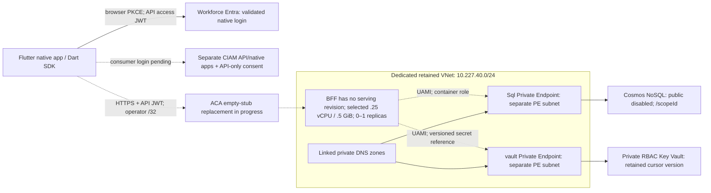

# Retained private ACA validation topology and deployment runbook

This records the selected minimal West US 2 configuration and its staged
execution, as of 2026-10-04 JST. The Cosmos account/database/container and its
human container role are created. All ten private-network/Key Vault prerequisite
resources applied successfully. The cursor key was initialized once; the public
bootstrap tool subsequently reused the same version's metadata with no PUT.
The dedicated BFF UAMI and exact container/secret permissions are also created.

**The BFF app has not run. A reviewed replacement of the empty ACA stubs is in
progress.** The environment's recovery ARM PUT returned `Succeeded`, but readback
showed no static IP and no resources in its owned platform group. The app failed
after approximately 21 minutes with zero revisions. The saved recovery plan
replaces only those same-name unused app/environment stubs; its four IAM resources
are unchanged. App deletion completed and environment deletion is underway.
No BFF protocol calls or application-data writes have occurred. HTTPS readiness,
private DNS from the runtime, Key Vault reference resolution, managed-identity
Cosmos access and the bounded SDK contract remain unperformed. ARM status and
role-assignment success do not close those runtime gates. See
[verification](verification.md) for the latest acceptance record.

The owner authorized necessary minimal Azure resources/settings in the selected
subscription and retained reusable resources. Actual names, IDs, private state,
operator IP and owner identity stay outside this public document. The earlier
failed East US account record is retained and is never selected as the compatible
data target.

The successful West US 2 account is governance-enforced
`publicNetworkAccess=Disabled`. Its retained Mac `/32` ACL is metadata, not a
private route. No public restoration, policy exception or firewall bypass is used.
[Cosmos public-access precedence](https://learn.microsoft.com/en-us/azure/cosmos-db/how-to-configure-private-endpoints)

## Selected resource and permission boundary

`PREFIX`, `VAULT`, `DATABASE` and `CONTAINER` are operator-selected placeholders.
Only the successful compatible account and dedicated retained group are used.

| Resource | Selected boundary and current stage |
| --- | --- |
| Cosmos DB for NoSQL | Existing successful single-write serverless account, Session consistency, local authentication disabled; database and `/scopeId` container created, TTL disabled; human data role only at this container |
| VNet | Created in West US 2: `PREFIX-vnet`, `10.227.40.0/24`; no peering, VPN, NAT or service endpoints |
| ACA subnet | Created: `aca`, `10.227.40.0/27`, delegated to `Microsoft.App/environments` |
| Private Endpoint subnet | Created: `private-endpoints`, `10.227.40.32/27`, separate and nondelegated |
| Dedicated Key Vault | Created: `VAULT`, Standard/RBAC, public disabled, default Deny/bypass None, no IP/subnet exceptions, purge protection and 90-day soft deletion; deployment/disk/template retrieval disabled |
| Cosmos Private Endpoint | Created for the exact account, `Sql` subresource, dedicated NIC and private DNS zone group |
| Vault Private Endpoint | Created for this vault, `vault` subresource, dedicated NIC and private DNS zone group |
| Private DNS | Created: `privatelink.documents.azure.com` and `privatelink.vaultcore.azure.net`, linked to this VNet, automatic registration disabled |
| Cursor secret | Initialized once outside Terraform: `cosmos-sync-cursor`, 32 random bytes in standard Base64; actual version URI retained, metadata-only reuse passed |
| BFF UAMI | Created: `PREFIX-bff`; serving workload association is pending the app |
| Cosmos native role/assignment | Created: only `ACCOUNT/dbs/DATABASE/colls/CONTAINER`; metadata read, item read/create/replace, query and readChangeFeed |
| Vault secret assignment | Created: Key Vault Secrets User only at `VAULT/secrets/cosmos-sync-cursor`, assigned to the BFF UAMI |
| ACA environment/app | Empty failed stubs are being replaced through the reviewed saved plan; no serving revision. Selected Consumption profile, HTTPS with current operator `/32` ingress, peer encryption, 0.25 vCPU/0.5 GiB, replicas 0–1 |
| Platform infrastructure | Exact managed-group name supplied through `infrastructure_resource_group_name`; failed environment had no static IP and zero group resources. Expected Standard LB and ingress/egress IPv4 require actual readback after recovery |

The prerequisite module manages ten resources: VNet, two subnets, vault, two
Private Endpoints, two DNS zones and two VNet links. NICs, DNS zone groups/records
and service-side connections accompany them. The workload module manages six:
UAMI, Cosmos native role/assignment, secret reader assignment, environment and
app. It does not create a database/container, provider app, log workspace, NAT,
VPN, private ACA ingress or subscription-wide runtime role.



Dashed runtime paths have not yet passed live acceptance. The native client
needs no direct Cosmos/Vault route or VPN. The BFF validates the JWT signature,
issuer, API audience and delegated scope, then enforces built-in personal/shared
ownership and membership. End users receive neither Cosmos keys nor privileged
cloud tokens. Data writes stop at one logical partition's atomic boundary.
[Cosmos permissions](https://learn.microsoft.com/en-us/azure/cosmos-db/reference-data-plane-security), [Vault secret-reader role](https://learn.microsoft.com/en-us/azure/role-based-access-control/built-in-roles/security#key-vault-secrets-user)

## Required settings and operator IAM

| Principal or setting | Required boundary |
| --- | --- |
| Deployment operator | Read/write the selected VNet/subnets/PEs/DNS/vault/ACA/UAMI resources; Cosmos `sqlRoleDefinitions`/`sqlRoleAssignments` management only for the selected account; `Microsoft.Authorization/roleAssignments/write` for exact runtime secret assignments; UAMI assign permission |
| Secret initializer | Existing ARM vault read and `Microsoft.KeyVault/vaults/secrets/read`/`write` on this named key; no new vault data-plane writer or executor |
| Runtime UAMI | The six documented Cosmos data actions only at the exact container; Key Vault Secrets User only at the named cursor secret; no Graph permission or Cosmos listKeys |
| Provider registration | Only needed subscription namespaces: Microsoft.App, Network, ManagedIdentity, DocumentDB, KeyVault and Authorization; Terraform auto-registration disabled |
| Native public client | Registered exact callback `com.anaregdesign.cosmossync://auth/oauthredirect`, browser code + S256 PKCE; no client secret or provider-ID-token substitution |
| BFF identity contract | Exact API issuer/audience/scope and intentional built-in namespace; native client ID is not the API audience; empty native CORS origins are intentional |
| Storage | Existing `/scopeId` container, TTL disabled, one write region, Session-or-stronger consistency, reviewed backup/retention |

The current hosted validation selects the already tested workforce API JWT. A
separate CIAM directory now has its own API/native registrations, corresponding
service principals and API-only `Cosmos.Sync` administrator grant. Its user flow,
Google/Apple providers and actual consumer login remain pending; that configuration
is not silently substituted into the workforce BFF. See
[consumer identity setup](external-id-setup.md) and [native auth](native-auth.md).

Role definition/assignment APIs are control-plane operations; granting the UAMI
data rights does not grant the operator or app subscription-wide Azure rights.
Registration uses the needed provider's `/register/action`, and feature enrollment
uses Microsoft.Features permissions. These are operator setup rights, not runtime
roles. [Provider registration](https://learn.microsoft.com/en-us/azure/azure-resource-manager/management/resource-providers-and-types), [Feature enrollment](https://learn.microsoft.com/en-us/azure/azure-resource-manager/management/preview-features)

## Traffic and cursor-key bootstrap

Use the existing public immutable image, with no registry secret or rebuild:

```text
ghcr.io/anaregdesign/cosmos-sync-bff@sha256:a23ab75eb4518597aa26e4833787b9b77a07def717868e080944555594adc1b3
```

Version `0.2.0-dev.1`, source `82e937c8659e9ec0263a78e6e3ad2f43e05be20a`.
Select an intentional built-in namespace and the same key/history epoch on every
serving revision. This environment uses no metrics or private-pull secret.

Private-only Vault prevents a direct Mac data-plane SetSecret. The reviewed
initializer uses the existing operator's ARM control-plane identity to write
exactly `vaults/VAULT/secrets/cosmos-sync-cursor`, API `2024-11-01`. The key stays
in RAM; there is no Terraform secret resource, deployment secure-parameter
history, CLI secret argument/environment variable, new writer role or new runner.
Only the real versioned URI and digests are recorded privately. The published
[bootstrap tool](../tools/bootstrap_cursor_key.py) preserves this boundary.
[Vault ARM network boundary](https://learn.microsoft.com/en-us/azure/key-vault/general/network-security#restrictions-and-limitations), [ARM secret schema](https://learn.microsoft.com/en-us/azure/templates/microsoft.keyvault/2024-11-01/vaults/secrets)

`--reuse-existing` performs only vault/secret metadata GETs and records the existing
version URI; it never retrieves a secret value or rotates. Actual reuse returned
the initialized version with no PUT. Metadata cannot prove key format, runtime
permissions or reachability: verify those through the BFF. ARM PUT is
create-or-update, so new initialization requires one designated external writer.
A fixed per-vault ledger/lock and durable prewrite record block local duplicate
attempts; ambiguous outcomes stop for operator inspection. Do not remove a
receipt, switch clones or generate another key to resolve an unknown outcome.

## Portable deployment and acceptance sequence

Use a POSIX host with Bash, Python 3.10+ (`fcntl` is required), curl, the pinned
Terraform/TFLint tools and an existing private Azure CLI profile. Keep deployment
source, tfvars, plans, state, credentials and receipts out of Git/public CI:

```sh
umask 077
COSMOS_DEPLOY_PRIVATE_DIR="$PWD/.cache/azure-deploy"
mkdir -p "$COSMOS_DEPLOY_PRIVATE_DIR"
chmod 700 "$PWD/.cache" "$COSMOS_DEPLOY_PRIVATE_DIR"
bash infra/terraform/aca-validation-plan/verify.sh
bash infra/terraform/azure-container-apps/verify.sh
python3 -m unittest discover -s tools -p 'test_bootstrap_cursor_key.py' -v
```

1. Select the compatible Cosmos account and owner-approved target/resources. Check
   account/container metadata, policy, backup, exact IAM, provider/feature status,
   resource names and published digest. Do not select the retained failed account.
2. Copy the prerequisite module into the private deployment directory; use private
   0600 tfvars with its six explicit target/name inputs. Initialize locked providers,
   save/review the real plan and apply only that saved plan. Preserve its state.
   Read back both private endpoints, DNS links/records and Vault private/RBAC/tags.
   This step is complete for the current validation resources.
3. After the reviewed prerequisite apply, make a separate immutable 0600 copy of
   its **raw** `terraform.tfstate` in a 0700 directory. Do not pass a saved plan,
   `terraform show` JSON or a live-changing state. Copy
   [cursor-bootstrap.example.json](../ops/azure/cursor-bootstrap.example.json)
   to a private 0600 file, replace placeholders with the exact vault/tenant/location,
   and bind `terraformState.sha256` to those exact copied bytes. Keep
   `resourceAddress=azurerm_key_vault.cursor` and the documented provenance value.
   The operator establishes the approved-apply provenance; the tool proves the
   bytes/target/security envelope match it.
4. Run the local bootstrap plan, then choose existing metadata reuse or the one
   explicitly authorized initialization below. Never pass a key/token through argv.
   The existing CLI profile remains selected explicitly; the tool neither logs in
   nor changes the CLI default context. CLI retains its normal private auth cache.
5. Copy the workload module and fill its private tfvars from reviewed prerequisite
   outputs: exact delegated subnet, vault ID/URL and **actual versioned** cursor URI;
   compatible account/DB/container, UAMI choice, API issuer/audience/scope, pinned
   digest, new namespace assertion, operator `/32`, replicas 0–1 and explicit new
   platform-managed group name. Review a real saved workload plan, then apply it.
6. After the app/revision is ready, record HTTPS endpoint and actual image/identity
   metadata. Run health/readiness, unauthorized/no-token/invalid JWT denial and
   the approved SDK smoke. Observe private DNS, Vault secret resolution and UAMI
   Cosmos access; resource mocks cannot establish them.
7. Pin any upgrade to a verified new digest; preserve compatible protocol/key/epoch/
   policy, save/review the change and validate the replacement revision before
   rollout. Coordinate rotation separately; never mix cursor keys or roll back
   revocation to recover an image. Retain the prior compatible configuration.

For a **fresh** private operator workspace, copy the modules once. Never overwrite
an existing deployment directory/state to retry or upgrade:

```sh
cp -R infra/terraform/aca-validation-plan/prerequisites "$COSMOS_DEPLOY_PRIVATE_DIR/prerequisites"
cp -R infra/terraform/azure-container-apps "$COSMOS_DEPLOY_PRIVATE_DIR/workload"
# Create and review 0600 prerequisite.tfvars.json and workload.tfvars here.
# Export only the existing private CLI profile path, never credentials:
export AZURE_CONFIG_DIR=/private/existing-azure-profile
export AZURE_LOGGING_ENABLE_LOG_FILE=no
terraform -chdir="$COSMOS_DEPLOY_PRIVATE_DIR/prerequisites" init -backend=false -input=false -lockfile=readonly
terraform -chdir="$COSMOS_DEPLOY_PRIVATE_DIR/prerequisites" plan \
  -var-file="$COSMOS_DEPLOY_PRIVATE_DIR/prerequisite.tfvars.json" \
  -out="$COSMOS_DEPLOY_PRIVATE_DIR/prerequisite.tfplan"
# Only after reviewing this exact plan within existing owner authority:
terraform -chdir="$COSMOS_DEPLOY_PRIVATE_DIR/prerequisites" apply "$COSMOS_DEPLOY_PRIVATE_DIR/prerequisite.tfplan"
cp "$COSMOS_DEPLOY_PRIVATE_DIR/prerequisites/terraform.tfstate" "$COSMOS_DEPLOY_PRIVATE_DIR/prerequisite-state.json"
chmod 600 "$COSMOS_DEPLOY_PRIVATE_DIR/prerequisite-state.json"
python3 -c 'import hashlib,sys; print(hashlib.sha256(open(sys.argv[1],"rb").read()).hexdigest())' \
  "$COSMOS_DEPLOY_PRIVATE_DIR/prerequisite-state.json"
```

Record that nonsecret hash in the private bootstrap config, alongside the exact
reviewed vault/tenant/location. The immutable copy remains separate from the
state Terraform will refresh. Keep both files and the approved plan private.
Bootstrap examples below use nonsecret private paths; replace them with your
reviewed files:

```sh
python3 tools/bootstrap_cursor_key.py --plan \
  --config /private/deploy/cursor-config.json --state /private/deploy/prerequisite-state.json
python3 tools/bootstrap_cursor_key.py --reuse-existing \
  --config /private/deploy/cursor-config.json --state /private/deploy/prerequisite-state.json \
  --azure-config-dir /private/existing-azure-profile
# New key only when confirmed absent, already authorized and no other writer:
python3 tools/bootstrap_cursor_key.py --execute --sole-writer \
  --approval-reference owner-approved-exact-bootstrap \
  --config /private/deploy/cursor-config.json --state /private/deploy/prerequisite-state.json \
  --azure-config-dir /private/existing-azure-profile
```

After bootstrap/reuse, read its private metadata receipt and fill
`key_vault.cursor_secret_uri` with the **same actual version**. The receipt holds
no key/token value. Complete and review workload inputs before these commands:

```sh
terraform -chdir="$COSMOS_DEPLOY_PRIVATE_DIR/workload" init -backend=false -input=false -lockfile=readonly
terraform -chdir="$COSMOS_DEPLOY_PRIVATE_DIR/workload" plan \
  -var-file="$COSMOS_DEPLOY_PRIVATE_DIR/workload.tfvars" \
  -out="$COSMOS_DEPLOY_PRIVATE_DIR/workload.tfplan"
# Only the reviewed saved plan, never an automatically recomputed apply:
terraform -chdir="$COSMOS_DEPLOY_PRIVATE_DIR/workload" apply "$COSMOS_DEPLOY_PRIVATE_DIR/workload.tfplan"
terraform -chdir="$COSMOS_DEPLOY_PRIVATE_DIR/workload" output endpoint
```

Record real `/healthz` and `/readyz` responses through the authorized HTTPS ingress
and denial for unauthenticated application routes. Then run the approved hosted
SDK gate with its reviewed private manifest and existing native credential session.
A populated Terraform endpoint output alone is not proof of those responses.

The cursor-bootstrap tool defaults offline; `--plan` makes no CLI/network/key/write calls. Private
inputs must be regular current-owner files at 0600 inside 0700 directories. FIFO,
symlink, duplicate JSON fields, target/state drift and unverified secret URIs are
rejected. TLS always validates its trust chain and never follows redirects.
Receipts stay under the checkout's `.cache/cursor-bootstrap/` at 0600; preserve
them with the reviewed state. State/plan encryption and locking in a selected
remote backend remain a separately reviewed operational setup.

For the hosted SDK gate use the bounded
[verifier](../tools/hosted_azure_live.py) and
[example manifest](../ops/azure/hosted-validation.example.json). Copy it to a
private 0600 file in a 0700 directory. Replace the deliberately invalid endpoint
with the verified Terraform HTTPS output, supply the exact private owner/registration
receipt and fresh API-JWT file paths, and reference actual target/write approvals.
Never put token contents in the manifest. The default invocation validates offline:

```sh
python3 tools/hosted_azure_live.py --manifest /absolute/private/hosted-validation.json
# After actual runtime and four HTTPS probe checks:
python3 tools/hosted_azure_live.py --manifest /absolute/private/hosted-validation.json \
  --dart-bin /absolute/path/to/dart --execute-approved
```

The selected single-account run allows at most 40 BFF requests, three accepted
application mutations and 120 seconds. Its example reserves four health/readiness/
denial probes and uses a 90-second/36-call SDK phase, leaving 20 seconds for probes
and ten for setup.
Account/policy metadata and SDK internal retries/RU are distinct from those
application-mutation/request bounds. No hosted app/data run has occurred yet.
Separate-user membership, two serving replicas, restart/failover and social-provider
acceptance remain separate gates; they are not implied by this small run.

## Service-side failure recovery

The first environment request rejected the literal log destination `"none"`.
The template now renders JSON `null` for disabled logs, matching the inspected
Azure CLI 2.88.0 behavior; no Log Analytics workspace is created. A subsequent
creation retained an environment in Failed state because this subscription lacked
`Microsoft.Network/AllowBringYourOwnPublicIpAddress`. That exact feature and the
Network provider now read Registered. Import/reconciliation of the same owned
environment then returned ARM `Succeeded`, but its static IP was absent and its
owned platform group contained zero resources. The app ended in
`ContainerAppOperationError` after approximately 21 minutes with zero revisions.
Activity Logs contain only the original six IP-creation attempts rejected for
the missing feature; no later LB/IP retry appeared during that reconciliation.
ARM `Succeeded` alone therefore did not establish a usable environment.

The current recovery applies a separately saved and reviewed plan replacing only
the **same-name, proven empty and unused** app/environment stubs. Three independent
reviews checked the two replacements and four IAM no-ops. A one-off private copy
permits only these two guarded replacements; the tracked module's destruction
guards remain enabled. App deletion completed and empty-environment deletion is
underway. Cosmos/database/container, Vault, key/version, Private Endpoints, DNS,
VNet/subnets, UAMI and all four IAM resources are retained. No alternate
environment, policy exception or BFF application-data write is introduced.

For another subscription, inspect the needed providers and the exact service
error. If that feature is required, enroll only it within the operator's authority,
wait for registration and re-register the Network provider to propagate it. Read
back static IP, platform-managed LB/IP resources and app revisions as well as ARM
status before proceeding. First reconcile/import only the exact owned resource
into its existing private state. Do not blindly repeat PUTs. An empty-stub
replacement requires verified ownership, no running revisions/data, a separately
reviewed saved plan limited to those resources and existing operator authority;
it is not a general destruction exception. Never manually delete the service
association link, delegated subnet, network or platform group. Never delete the
validation group or repeat key initialization to repair environment provisioning.
[Feature registration propagation](https://learn.microsoft.com/en-us/azure/azure-resource-manager/management/preview-features)

## Cost and retention choices


These are USD ordinary PAYG estimates from current official Retail Prices API
meters, checked 2026-10-04 JST, before tax/exchange/employee-contract adjustments.
Shared subscription free grants and any infrastructure fee exemptions are not
assumed available.

| Network fixed component | Hourly/monthly estimate |
| --- | --- |
| Two Standard static IPv4 plus Standard LB | $0.035/hour; about $25.55/730 hours |
| Two backend Private Endpoints | $0.02/hour combined; about $14.60/730 hours |
| Two Private DNS zones | About $1.00/month combined, plus queries |
| **Retained total network base** | **About $41.15/730-hour month**, before data/queries/extra platform rules |

LB processing is $0.005/GB; endpoint processing starts at $0.01/GB; actual
platform rule counts must be checked for additional LB rules. Private Endpoint
partial hours are charged as full hours; DNS zones are calculated by days, so a
120-second smoke test still has initial network charges. These fixed components
remain when replicas are zero. Dedicated profiles, ACA-environment private
ingress endpoints and planned maintenance are omitted; their extra management
fees are outside this estimate and are not silently enabled. [ACA managed resources](https://learn.microsoft.com/en-us/azure/container-apps/custom-virtual-networks#managed-resources), [Private Link prices](https://azure.microsoft.com/en-us/pricing/details/private-link/), [DNS prices](https://azure.microsoft.com/en-us/pricing/details/dns/), [Official pricing API](https://learn.microsoft.com/en-us/rest/api/cost-management/retail-prices/azure-retail-prices)

West US 2 ACA active prices are $0.000034/vCPU-second and
$0.000004/GiB-second, plus $0.40/million requests beyond its shared monthly grant.
One 0.25-vCPU/0.5-GiB replica continuously active costs about $0.0378/hour before
grants; 120 seconds plus the reference's 300-second cooldown is about $0.00441 in
active CPU/memory alone. Cold start/setup, other requests, network persistence,
Cosmos RU/storage/backup/egress and Key Vault operations are additional. Cosmos
serverless is $0.25/million RU; Key Vault Standard is $0.03/10,000 operations.
Replicas and BFF request limits are not billing caps. [ACA prices](https://azure.microsoft.com/en-us/pricing/details/container-apps/), [Key Vault prices](https://azure.microsoft.com/en-us/pricing/details/key-vault/), [Cosmos prices](https://azure.microsoft.com/en-us/pricing/details/cosmos-db/)

Retain-for-reuse is the current default: the reusable resources stay. A temporary
hosted verification followed by explicit retirement of only the new ACA app,
environment and managed LB/IP removes that component but leaves approximately
$15.60/month for retained endpoint/DNS connectivity. Scaling/stopping the app
does not remove the $25.55 network component. Such retirement needs a separate
review and owner authorization; it never authorizes removing Cosmos, Entra,
cursor key, data or the validation group. No teardown permission is inferred.

Ordinary service endpoints would be cheaper in a subscription permitting selected
public-network access, but cannot pass the governance-enforced disabled setting
here. NAT would add recurring cost and would not overcome that policy. Mac VPN,
peering, an existing private operator path and private ACA ingress are outside
this selected configuration. The initial hosted smoke avoids new Mac private networking.

## Execution status and evidence

The prerequisite apply and cursor initialization/reuse are actual Azure results;
the runtime identity/role resources are also created. ARM environment recovery
did not produce platform infrastructure or a serving app. The reviewed empty-stub
replacement is in progress; app/runtime acceptance gates are still pending, with
no BFF protocol calls or application-data writes. The latest local suite passed 22
workload-module mock plans, seven prerequisite mock plans, both pinned validators
and 127 Python tool tests (84 existing, 13 hosted-gate, 30 bootstrap tests). These
checks establish source/guard behavior, not hosted health or data access.

Fresh workforce Mac AppAuth passed its callback, Keychain restore, refresh and
API JWT proof. It is distinct from the new CIAM registrations and from hosted
Cosmos/ACA acceptance. Preserve that separation in Issues and
[verification](verification.md). Credentials never need to be pasted into chat.
